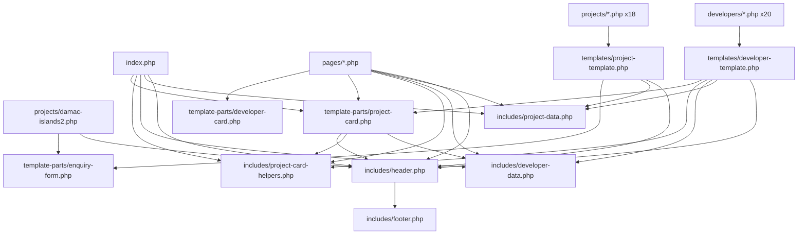

# Project Engineering Audit

**Project:** D:\Projects\SMB-realestate
**Audit date:** 2026-07-23
**Nature of this document:** Analysis and reporting only. No production file was modified as part of this audit — see "Verification" at the end of this document for the `git status` proof.

---

# Executive Summary

This is a flat-file PHP site (no framework, no database) that has already been through two rounds of structural improvement: a folder reorganization (`pages/`, `developers/`, `projects/`, `templates/`, `template-parts/`, `includes/`, documented in `docs/project-architecture-report.md`) and a component-extraction pass that consolidated the project card (`template-parts/project-card.php`), the developer card (`template-parts/developer-card.php`), and the project enquiry form (`template-parts/enquiry-form.php`) into single canonical implementations. Those extractions were done carefully — each was verified byte-identical or visually-identical against the pre-extraction output.

What remains is concentrated, not pervasive. The single highest-value finding in this audit is that **`pages/developers.php`'s "Featured Developers" section still hand-authors 20 nearly-identical setup blocks** (one per developer, differing only in a literal name string) instead of iterating `data/developers.json` directly — and the blocks are in the exact same order as the JSON file, meaning a plain `foreach` loop would produce byte-identical output while deleting ~120 lines of repeated setup code, a page-local override map, and a page-local reconciliation function that exists only to compensate for the hand-authored list in the first place. This is a self-contained, low-risk, high-value fix.

Beyond that, the remaining issues are the kind every real project accumulates: two different escaping idioms used interchangeably (`smb_e()` vs. raw `htmlspecialchars(...)`), a breadcrumb feature implemented two different ways in two different files, FAQ content duplicated within a single file (visible markup vs. JSON-LD), a defensive-but-fragile cross-file function dependency in the data layer, and the expected pre-CMS hardcoding (asset paths, site URL, nav items) that a WordPress conversion — not this codebase — is the correct place to resolve. No critical, request-breaking defects were found. No database, no external API, and no framework dependency exists anywhere, which meaningfully simplifies everything in this report.

---

# Audit Scope

Inspected in full: all 56 PHP files (root, `pages/`, `developers/`, `projects/`, `templates/`, `template-parts/`, `includes/`), all 7 CSS files, the 1 JavaScript file, both JSON data files and their schemas, the `.htaccess` rewrite layer, and the relevant planning documents in `docs/`. This audit builds on, and re-verifies against the *current* file state, the two prior structural reports already in `docs/` (`project-architecture-report.md`, `project-engineering-audit.md`'s own prior sibling `CURRENT-PROJECT-STRUCTURE-AUDIT.md`) — several findings in those earlier documents (project-card triplication, developer-card duplication, enquiry-form duplication) have since been resolved and are marked as such below rather than re-flagged as open issues.

Excluded per standard convention: `.git`, `.claude/`, `.agents/`, `tools/` (confirmed empty, non-architectural).

**Extension pass (this update):** ten additional dimensions — Performance, Naming Consistency, Include Graph, Dependency Graph, Global Variables, Function Responsibility, Template-Part Public API, Complexity, Coupling Matrix, and Future WordPress Mapping — were added by directly re-inspecting the current repository (fresh `wc -l`/`grep` counts, fresh reads of `includes/project-data.php`, `includes/developer-data.php`, both full templates, `.htaccess`, and every CSS file) rather than relying on the existing findings above. This pass surfaced one genuinely new finding not present in the original report — a confirmed-dead `.project-card` CSS ruleset in `assets/css/home.css` — which has been folded into the existing CSS Architecture Findings and Prioritized Remediation Roadmap sections rather than left isolated.

---

# Current Architecture Overview

```
index.php (root)                     — homepage, stays at root for DirectoryIndex
.htaccess                             — rewrites flat URLs to the folders below
pages/                                — about, services, developers, communities, contact
developers/ (20 files)                — 3-line wrappers: set $developer_slug, require the template
projects/ (18 wrappers + damac-islands2.php standalone)
templates/                            — developer-template.php, project-template.php (the "single-*" layer)
template-parts/                       — project-card.php, developer-card.php, enquiry-form.php
includes/                             — header.php, footer.php, project-data.php, developer-data.php,
                                         project-card-helpers.php
data/                                 — developers.json + schema, projects.json + schema
assets/                               — css/ (7 files), js/ (1 file), images/, videos/, fonts/, icons/
docs/                                 — specifications + prior audit reports
```

Every page's public URL is flat (`/about.php`, `/aldar-properties.php`) regardless of where the file physically lives; `.htaccess` performs an invisible internal rewrite, and `includes/header.php` derives canonical/OG/Twitter URLs from `$_SERVER['REQUEST_URI']` specifically so this rewrite doesn't leak into SEO metadata. There is no database, no ORM, no external API call, and no third-party JS library anywhere in the codebase — the entire "dynamic" behavior is PHP reading two local JSON files at request time.

---

# Naming Consistency Audit

| Current name | Location | Issue | Recommended action | Worth the regression risk? | Correct timing |
|---|---|---|---|---|---|
| `template-parts/project-card.php` renders `class="comm-card"` | The file's own markup | The template-part's filename says "project," the CSS class it emits says "comm" (short for "community") — a reader grepping CSS for `.project-card` to find this component's styles will not find it | Document only (the file's docblock already names its purpose clearly); do not rename the CSS class | No — the class is live on 3 call sites and is what `assets/css/communities.css` targets today | Migration-time rename only, if at all — WordPress conversion is the natural point to align the partial's filename (`template-parts/cards/project-card.php`) with a class rename in one coordinated pass |
| `template-parts/developer-card.php` renders `class="dev-card"` | The file's own markup | Same pattern — filename says "developer," CSS says "dev" | Same as above | No | Migration-time only |
| `.project-card` in `assets/css/home.css` (lines 111–160) | `assets/css/home.css` | Confirmed via repo-wide search: **no PHP file anywhere renders `class="project-card"`.** This is not a naming mismatch, it is dead CSS left behind when the project-card markup was consolidated into `template-parts/project-card.php` using the `.comm-card` class instead | Delete the ~50-line dead ruleset | **Yes** — this is a deletion, not a rename; zero visual risk since nothing references it | Now (see Roadmap P3 update below) |
| `.community-card` (home.css) vs `.comm-card` (communities.css) vs the now-dead `.project-card` (home.css) | `assets/css/home.css`, `assets/css/communities.css` | Three different "card" name roots across two files for what reads, at a glance, like it could be one concept. In practice they are three genuinely different components: `.community-card` is a static, non-data-driven "explore" tile used 6× in `index.php` (all linking to `#enquire`); `.comm-card` is the shared, data-driven project-card partial's class; `.project-card` is dead | No rename — each live name is stable, correctly scoped, and already understood by its own stylesheet's consumers | Not worth the risk for a cosmetic gain | Never, or migration-time at most |
| `developer_slug()` — defined in `includes/project-data.php` | `includes/project-data.php:165` | A developer-oriented function living in the project-data file — this is the same "hidden coupling" finding already documented in **Separation of Concerns Findings** and scheduled as a P2 fix; listed here only for naming-location completeness | Move to `includes/developer-data.php` | Yes — already scheduled | Now (already P2 in the existing roadmap) |
| `$dev` / `$dev_rec` / `$developer` — three names for closely related "current developer" values across `pages/developers.php`, `templates/developer-template.php`, and `template-parts/developer-card.php` | All three files | `$dev` = the canonical-name string; `$dev_rec` = the resolved JSON record in `pages/developers.php`; `$developer` = the resolved JSON record in `templates/developer-template.php` and the parameter name in `includes/developer-data.php`'s functions. A newcomer must track that `$dev_rec` and `$developer` are the same *kind* of value under two names | Align on one name (`$developer` for the record, matching the data-loader functions' own parameter naming) opportunistically while already touching `pages/developers.php` for the P1 Featured-Developers-loop fix | Worth doing only as part of that already-planned edit, not as a standalone task | During the P1 Featured Developers fix (already scheduled) |
| Internal working-variable prefixes across sibling template-parts: `$card_*` (`project-card.php`), `$dev_card_*` (`developer-card.php`), `$ef_*` (`enquiry-form.php`) | The three `template-parts/*.php` files | Three different internal-prefix styles for the same architectural role ("this partial's own scratch variables") | No fix needed for existing files — these are internal, not part of the public contract (see **Template-Part Public API Audit**) | Not worth touching working files | Apply a single convention only to new template-parts going forward |
| CSS BEM-like convention (`__element`, `--modifier`, e.g. `.lead-form--card`, `.hero--page`, `.section--gray`) | All 7 CSS files | Applied consistently everywhere audited | None — this is a strength, not a finding | n/a | n/a |
| Folder naming (`developers/`, `projects/`, `pages/` = plural content folders; `templates/`, `template-parts/`, `includes/` = singular architecture folders) | Repository root | Consistent, self-explanatory | None | n/a | n/a |
| JSON/schema keys (`page_title`, `location_label`, `starting_price` — snake_case throughout, matching PHP array-key access exactly) | `data/*.json`, `data/*.schema.json` | Fully consistent between schema and PHP consumption | None | n/a | n/a |
| Route/slug naming (developer and project slugs are kebab-case and identical across the JSON `slug` field, the wrapper filename, the anchor ID, and the `.htaccess` rule) | `data/developers.json`, `data/projects.json`, `developers/*.php`, `projects/*.php`, `.htaccess` | Fully consistent and load-bearing in four places at once — a rename anywhere would need to happen in all four simultaneously, which is a real coupling (see **Coupling Matrix** — `.htaccess`) but not a naming inconsistency | None — flagged as a strength, with its coupling implication cross-referenced | n/a | n/a |

**Overall naming assessment:** the project does not have arbitrary or careless naming — every name audited above is *locally* consistent and stable. The friction is entirely at the *boundary* between components (a file's name vs. the CSS class it emits, or a function's name vs. its actual file location), never within a single file or component. This is exactly the kind of naming drift that accumulates naturally across incremental feature work and is best resolved in one coordinated pass — which the WordPress conversion already provides — rather than piecemeal now.

---

# Include Graph

Six distinct include patterns cover all 56 PHP files; no file falls outside one of them.

```
Pattern A — Standalone content page (about, services, contact)
  pages/{about,services,contact}.php
    → includes/header.php   (defines smb_e(), $nav_items; computes $canonical_url, $current_file)
    → [page body — no data-layer include needed]
    → includes/footer.php

Pattern B — Standalone data-driven listing page (developers, communities)
  pages/developers.php
    → includes/project-data.php   (used only for get_projects_by_developer(), per-card project counts)
    → includes/developer-data.php
    → includes/header.php
    → [20× featured-developer setup block] → template-parts/developer-card.php   (×20)
    → includes/footer.php

  pages/communities.php
    → includes/project-data.php
    → includes/developer-data.php
    → includes/header.php
    → includes/project-card-helpers.php   (require_once, before the loop)
    → template-parts/project-card.php   (require, ×18 — once per project)
    → includes/footer.php

Pattern C — Homepage
  index.php
    → includes/project-data.php
    → includes/developer-data.php
    → includes/header.php
    → includes/project-card-helpers.php   (require_once)
    → template-parts/project-card.php   (require, ×6 — featured projects only)
    → includes/footer.php

Pattern D — Developer archive (20 wrapper files → 1 template)
  developers/{slug}.php  (3 lines: set $developer_slug, require the template)
    → templates/developer-template.php
        → includes/project-data.php
        → includes/developer-data.php
        → includes/header.php
        → includes/project-card-helpers.php   (require_once)
        → template-parts/project-card.php   (require, ×N — that developer's projects)
        → includes/footer.php

Pattern E — Project page, template-driven (18 wrapper files → 1 template)
  projects/{slug}.php  (3 lines: set $project_slug, require the template)
    → templates/project-template.php
        → includes/project-data.php
        → includes/header.php
        → template-parts/enquiry-form.php   (require, ×2 — hero + main variants)
        → includes/footer.php

Pattern F — Project page, standalone (the one exception)
  projects/damac-islands2.php
    → includes/header.php
    → template-parts/enquiry-form.php   (require, ×2 — hero + main variants)
    → includes/footer.php
    (no project-data.php — this page is not in data/projects.json, per prior audit findings)
```



**`require` vs. `require_once` findings:**

- `includes/project-card-helpers.php` is the *only* file loaded via `require_once` project-wide, and correctly so — it defines global functions (`comm_project_card_image()`, etc.) and is loaded once per page but its consuming template-part (`template-parts/project-card.php`) is then `require`d (not `require_once`) once per loop iteration, since that file contains markup only, no declarations. This `require_once`-for-declarations / `require`-for-markup split is exactly correct and is one of the strongest small design decisions in the project.
- Every other include — `includes/header.php`, `includes/footer.php`, `includes/project-data.php`, `includes/developer-data.php`, both full-page templates — uses plain `require`, even though `project-data.php` and `developer-data.php` both define global functions (`get_all_projects()`, `get_developer_by_slug()`, etc.). **This works today only because every call site is disciplined about including each of these exactly once per request** — verified across all six patterns above, no pattern double-includes any data loader. It is one policy change (a future page or template accidentally requiring `project-data.php` a second time) away from a fatal "Cannot redeclare function" error. **Recommendation (low effort, zero behavior change): switch these five `require` calls to `require_once`.** This costs nothing today and removes a fragile assumption. (See Prioritized Remediation Roadmap — added as a new P2 item below.)
- No circular dependency exists anywhere in the graph — every arrow above points in one direction (page → template → template-part → data/includes), confirmed by inspecting every file's own `require` statements.
- **Hidden/load-order dependency:** `template-parts/project-card.php` calls `get_developer_by_canonical_name()` (from `includes/developer-data.php`) and `comm_property_type_icon()` etc. (from `includes/project-card-helpers.php`) and `smb_e()` (from `includes/header.php`) without requiring any of the three itself — it relies entirely on the caller having loaded all three first. This is documented in the partial's own docblock and, today, always true across its 3 consumers (verified) — but it is a convention, not an enforced contract. Cross-referenced in the **Template-Part Public API Audit** below.
- `includes/footer.php` reads `$site_url`, which is defined inside `includes/header.php`, not passed explicitly — this is a real, if minor, "must run after" ordering dependency. It has never been violated (footer.php is always the last require on every page, verified across all six patterns), but it is implicit rather than guarded.

---

# Dependency Graph

This is the logical/architectural view — components, not individual files.

```
 Rewrite/Routing layer        .htaccess
        │  (determines which physical file serves a flat URL)
        ▼
 Page layer                   index.php, pages/*.php, developers/*.php, projects/*.php
        │
        ▼
 Template layer                templates/developer-template.php, templates/project-template.php
        │
        ▼
 Template-part layer           template-parts/project-card.php, developer-card.php, enquiry-form.php
        │
        ├──────────────┐
        ▼              ▼
 Data layer            Helper layer
 includes/project-data.php     includes/project-card-helpers.php
 includes/developer-data.php   (project_icon_symbol(), project_safe_local_path() —
 data/*.json                    both template-local, not shared)
        │
        ▼
 (no lower layer — data/*.json is the floor)

 Cross-cutting, not layered:
   SEO metadata layer      — includes/header.php (canonical/OG/Twitter) + per-template JSON-LD blocks
   Form-validation layer   — assets/js/main.js (validators/setupForm) + template-parts/enquiry-form.php (markup contract)
   Asset layer             — assets/css, assets/js, assets/images — reached directly, via literal string
                              paths, from EVERY layer above (Page, Template, Template-part, and even the
                              Data layer, since data/projects.json stores image path strings) — there is
                              no path-resolution function anywhere; this is the layer with no stable
                              interface, and it is the single largest piece of work the WordPress
                              migration must do (see Future WordPress Architecture Mapping)
   Configuration/settings  — does not exist as its own layer today. Site phone/email/address are typed
                              directly into the Page layer (pages/contact.php) and Template layer
                              (templates/project-template.php, projects/damac-islands2.php) and the
                              includes/footer.php file, rather than being consumed from one settings
                              source (already covered in Hardcoded Content Inventory — restated here only
                              to name it as a missing architectural layer, not a new finding)
```

**Key dependency risks:**

- **The asset layer has no contract** — every other layer reaches into it with raw string literals rather than through a function. This is not a current bug (verified: every referenced path resolves correctly today), but it is the one dependency shape that must change during WordPress migration (Media Library URLs replace literal paths), and it cannot be fixed incrementally without first having a WordPress Media Library to point at — correctly deferred, not a current fix.
- **`.htaccess`'s coupling to filenames is a reverse dependency of sorts**: the routing layer must be kept in lockstep with the Page layer's actual filenames (every `developers/*.php`/`projects/*.php` file must have a matching `.htaccess` alternation entry). This is a real, named coupling — already covered in the original report's Routing and URL Findings and the Coupling Matrix below — cross-referenced, not re-explained.
- **`smb_e()` is a foundational, cross-layer utility that lives in the Page-bootstrap file (`includes/header.php`) rather than a dedicated escaping include** — every Template and Template-part consumer effectively has a soft "reverse" dependency on the Page layer's bootstrap file for something that is conceptually more foundational than "header." Already noted in the existing Separation of Concerns Findings section; cross-referenced here as the dependency graph's one true layering irregularity.

**Stable architectural boundaries (do not change):**

- Page layer → Template layer → Template-part layer → Data layer is a clean, one-directional chain with zero reverse dependencies found anywhere.
- The Data layer (`includes/project-data.php`/`developer-data.php` + `data/*.json`) has zero knowledge of any layer above it — confirmed by both files' own docblocks and by direct reading. This boundary is the strongest one in the project and should be preserved exactly as-is through any future refactor, including the WordPress migration (it becomes the seed for CPT meta access).

**Boundaries that should be improved (already scheduled, cross-referenced, not re-litigated here):**

- Configuration/settings as a named layer — P2 in the existing roadmap (centralize phone/email/address).
- The path-safety check duplicated across the Helper and Template layers — P1 in the existing roadmap.

---

# Engineering Maturity Scores

| Area | Score /10 | Evidence |
|---|---|---|
| Structure | 8 | Clear `pages/developers/projects/templates/template-parts/includes` separation; each folder's purpose is unambiguous from its name alone |
| Consistency | 6 | Two escaping idioms (`smb_e()` in most files vs. raw `htmlspecialchars(...ENT_QUOTES, 'UTF-8')` in `templates/developer-template.php`); `declare(strict_types=1)` present in some files, absent in others with no apparent rule. **Reinforced, not worsened, by the new Naming Consistency Audit**: template-part filenames vs. their emitted CSS class names disagree (`project-card.php` → `.comm-card`; `developer-card.php` → `.dev-card`), and one CSS ruleset (`.project-card` in `home.css`) is confirmed dead — all boundary-level naming drift, none of it internal to a single file. Score held at 6, since this is additional evidence of the same class of issue already reflected in the score, not a new or worse category of problem |
| Separation of concerns | 7 | Data loaders (`includes/project-data.php`, `includes/developer-data.php`) are genuinely presentation-free; templates still mix data resolution with rendering inline (acceptable at this project's size, see Template Findings) |
| Reuse | 7 | Three genuine shared components now exist (project-card, developer-card, enquiry-form) with explicit, documented input contracts; the "Featured Developers" list in `pages/developers.php` is the one remaining un-reused loop |
| Data architecture | 8 | Schema-validated, cached, sole-responsibility loaders with a controlled-failure path (`project_data_fail()`/`developer_data_fail()`); one fragile cross-file function dependency (see Data Architecture Findings) |
| Template quality | 7 | Templates are long but linear and readable; no template mixes two unrelated page types; the 404 branch is duplicated near-verbatim between the two templates |
| Defensive coding | 7 | `project_safe_local_path()` rejects remote/traversal paths; JSON decode failures are caught and produce a controlled 500 rather than a fatal error; array-key access is `?? ''`-guarded almost everywhere |
| Maintainability | 7 | Recent extractions materially improved this; the hand-authored developer list is the main open maintenance trap |
| Scalability (content growth) | 6 | Adding a 21st developer or 19th project today means creating a wrapper file *and* a `.htaccess` line *and*, for a "featured" developer, a new hardcoded block — three touch points for one conceptual addition |
| WordPress readiness | 7 | Two data-driven templates that already look like `single-*.php`; two JSON files that are effectively pre-written ACF field specs; the main remaining work is CPT registration and asset/URL abstraction, not data modeling |

**Overall: 7.0 / 10** — a solidly-built, slightly-inconsistent, pre-CMS PHP site with no structural rot and one clear, high-value cleanup opportunity.

---

# Performance Audit

## Current performance strengths

- **In-request caching is correctly applied where it matters.** `load_projects_data()`/`load_developers_data()` (`includes/project-data.php`, `includes/developer-data.php`) both use a `static $cache` guard, so each JSON file is read and decoded **at most once per request** via that path. `get_projects_grouped_by_developer()` layers its own `static $cache` on top, meaning `pages/developers.php`'s 20 per-developer `get_projects_by_developer()` calls trigger exactly one file read + one grouping pass total, not 20 — verified by tracing the call chain, not assumed.
- **No nested loops over the full dataset exist anywhere.** The deepest genuine nesting found in any template is 2 levels (`templates/developer-template.php:66-89`, a developer's projects looped once, each project's image candidates looped once inside — confirmed by direct line-by-line reading, not an automated complexity score). `templates/project-template.php`'s 18 `foreach` blocks (line numbers 217, 244, 267, 290, 325, 331, 364, 400, 425, 445) are all sibling loops over small, fixed-size arrays (facts capped at 4, overview cards capped at 3, gallery capped at 4, places capped at 4) — none are nested inside each other.
- **Hero images correctly use `fetchpriority="high"`** (verified on every hero image across `index.php`, all `pages/*.php`, both templates, and `damac-islands2.php`) and **no hero image is marked `loading="lazy"`** — the opposite would actively harm LCP.
- **Non-hero images consistently use `loading="lazy"` plus explicit `width`/`height`** (team photos, gallery images, card images — e.g. `templates/project-template.php:377`'s gallery `` sets `width="<?= $dims[0] ?>" height="<?= $dims[1] ?>"`), which reserves layout space and avoids CLS.
- **Hero background images (`.hero__bg`) intentionally omit `width`/`height`** — verified this is not an oversight: these images are `position: absolute; inset: 0` in `main.css`, filling a container whose height is already fixed by CSS (`min-height`/`height` on `.hero`), so they never participate in layout flow the way an inline content image does. Omitting dimensions here causes no CLS risk; the pattern is applied consistently across every hero image in the codebase.
- **The homepage hero video correctly has a poster image and a static `` fallback** (`index.php:30-36`) sitting behind it in DOM order, and `home.css`'s `@media (prefers-reduced-motion: reduce) { .hero--home .hero__bg--video { display: none; } }` removes the video entirely for users who've opted out of motion — both a performance and an accessibility win in one rule.
- **`assets/js/main.js` is placed immediately before `</body>`** (`includes/footer.php:97`), which is the correct non-blocking position — no `defer`/`async` attribute is needed because the script already loads after all content has parsed.
- **The font uses `font-display: swap`** (`main.css:12`) and is preloaded (`includes/header.php:81`, the only `<link rel="preload">` in the project) — text renders immediately with a fallback font rather than blocking on the webfont.
- **No render-blocking third-party script exists anywhere** — confirmed by repo-wide search; the entire JS payload is the one 255-line `main.js` file.

## Current risks

- **`.htaccess` sets no cache-control, expires, or compression directives** — confirmed by reading the full file; it contains only the three `RewriteRule` groups. Static assets (`assets/css/*.css`, `assets/js/main.js`, every image/video/font) are served with whatever default headers the hosting environment applies, which for many shared-hosting Apache configs means no explicit long-lived cache header and no guaranteed `gzip`/`brotli` compression. This is a real, fixable gap, **but not a code defect** — it is a server-configuration addition, and given the earlier reorg's uncertainty about whether the live host even honors `.htaccess` `mod_rewrite` directives (documented risk in `docs/project-architecture-report.md`), adding cache/compression directives now would carry the same unverifiable-until-deployed risk. **Recommended only as a deploy-time checklist item, not a code change today.**
- **`get_all_projects_safe()` has no caching of its own** (unlike `load_projects_data()`) — it performs its own independent file read + `json_decode` every time it is called directly. Verified call sites today: `index.php:72` and `pages/communities.php:74` call it directly (once each, on different requests — no double-read), and `includes/project-data.php:132` calls it once inside the already-cached `get_projects_grouped_by_developer()`. **No page today calls it more than once per request.** This is a latent fragility, not a current bottleneck: if a future page combined a direct `get_all_projects_safe()` call with a feature that also triggers `get_projects_grouped_by_developer()`, `projects.json` would be read and decoded twice in that one request. At 18 records this costs microseconds either way — flagged for completeness, not as something to fix now.
- **Every page loads the full CSS cascade for its type** (e.g. every project page loads `main.css` + `home.css` + `about.css` + `services.css` + `contact.css` + `communities.css` — six files, per `templates/project-template.php`'s and `templates/developer-template.php`'s `$page_styles` arrays) even though most of a given page only uses a fraction of those rules (e.g. a project page's `$page_styles` includes `services.css`'s FAQ-accordion rules, which no project page renders). This is **harmless at the current file sizes** (7 files, 1,866 total CSS lines, well under any meaningful transfer-size concern) and is the direct, reasonable cost of the project's documented shared-component CSS cascade (see the existing CSS Architecture Findings section) — **not worth splitting into more granular, page-specific bundles without a build step to manage the resulting complexity.**

## Page-load concerns

- None of the per-page CSS files exceed 356 lines (`home.css`), and `main.css` itself is 791 lines — none of this is large enough to be a real transfer-time concern over any network condition worth designing for today.
- The largest single asset category is images (`assets/images/` — 649 files across the whole site, but only a handful are ever requested per page load, since each project page only references its own `assets/images/projects/{slug}/` folder plus 1-2 shared fallback images). No page was found to reference more images than it visually displays.

## Server-side concerns

- PHP execution per request is minimal: one or two JSON file reads (cached), a handful of `foreach` loops over small arrays (≤20 items), and string-templated HTML output. There is no database query, no external HTTP call, and no computationally expensive operation (no image processing, no regex-heavy parsing beyond the small safety checks in `project_safe_local_path()` and its duplicates) anywhere in the request lifecycle. **This is about as fast as a PHP page can be without a bytecode cache being the only remaining lever** — and OPcache is a hosting-environment setting, not a code change.

## Frontend concerns

- `IntersectionObserver`-driven scroll-reveal (`assets/js/main.js:105-125`) is applied to every `[data-reveal]` element on a page — on the longest pages (`templates/project-template.php`'s rendered output, ~20+ reveal-tagged elements) this means 20+ observer registrations per page load. This is well within what `IntersectionObserver` is designed for and is not a measurable performance concern at this scale.
- No layout-shift risk was found beyond what's already covered above (hero background images are absolutely positioned; every other image has explicit dimensions).

## Quick wins

- None that don't already appear in the existing Prioritized Remediation Roadmap. Performance is not an area with unaddressed low-effort/high-value fixes in this codebase today — its strengths already listed above are the reason.

## Changes to defer until WordPress migration

- Any CDN, image-optimization pipeline, or asset bundler — WordPress's own asset pipeline (or a caching plugin) is the natural home for this, and building a custom one now for a soon-to-be-replaced PHP layer would be wasted work.
- `.htaccess` cache-control/expires headers — worth revisiting once the final hosting target (and whether it stays Apache) is confirmed as part of the migration plan, not before.
- Any lazy-loading strategy change — the current `loading="lazy"` usage is already correct and idiomatic; WordPress's own image handling (`wp_get_attachment_image()`) preserves this automatically once images move to the Media Library.

---

# Critical Findings

No finding in this audit rises to "critical" in the sense of a live defect (fatal error, broken URL, security hole, broken output). The items below are the highest-value architectural findings; none block the site from functioning correctly today.

1. **`pages/developers.php`'s Featured Developers section is 20 hand-duplicated setup blocks that already match `data/developers.json`'s exact order** — see Duplication Inventory #1. This is the single highest-value fix in the project.
2. **Two independent BreadcrumbList JSON-LD implementations** (`includes/header.php`'s generic 2-item version vs. `templates/developer-template.php`'s hand-built 3-item version) — see SEO Findings.
3. **FAQ content duplicated within the same file** between visible `<details>` markup and JSON-LD, in both `pages/services.php` and `pages/communities.php` — see Duplication Inventory #6.

---

# Duplication Inventory

| # | Duplication | Files | Responsibility duplicated | Severity | Extract? | Destination | Benefit | Risk |
|---|---|---|---|---|---|---|---|---|
| 1 | 20 near-identical developer setup blocks | `pages/developers.php` | Resolving one developer's slug/URL/display-name/record from a hardcoded canonical-name literal | **Critical** | Yes — replace with `foreach (get_all_developers() as $developer)` | Inline in `pages/developers.php` (no new file needed) | Deletes ~120 lines, the `$dev_canonical_names` map, and the `developer_canonical()` function entirely; the featured list becomes "all current developers" automatically, so a future 21st developer needs zero page edits | Low — order already matches JSON exactly (verified); output would be byte-identical |
| 2 | Project-card markup + 3 helper functions | *(historical — already resolved)* was `index.php`, `pages/communities.php`, `templates/developer-template.php` | Card rendering | Resolved | Already extracted to `template-parts/project-card.php` + `includes/project-card-helpers.php` | — | — |
| 3 | Developer-card markup | *(historical — already resolved)* was `pages/developers.php` | Card rendering | Resolved | Already extracted to `template-parts/developer-card.php` | — | — |
| 4 | Enquiry-form markup (hero + main variants) | *(historical — already resolved)* was `templates/project-template.php`, `projects/damac-islands2.php` | Form rendering | Resolved | Already extracted to `template-parts/enquiry-form.php` | — | — |
| 5 | Controlled-404 branch | `templates/developer-template.php` (lines 17–43), `templates/project-template.php` (lines 19–46) | 404 status + not-found page markup | Medium | Optional — could become `template-parts/not-found.php` taking a `$not_found_heading`/`$not_found_links` context | Small file, ~25 lines each, ~90% identical (only the heading text and the two link hrefs/labels differ) | Two call sites only; extraction saves ~20 lines total — genuinely marginal value, listed as optional not required |
| 6 | FAQ content (visible `<details>` vs. JSON-LD) | `pages/services.php` (5 Q&A, written twice), `pages/communities.php` (6 Q&A, written twice) | The FAQ answer text itself | High | Yes, but only within each file — build one PHP array of `[question, answer]` pairs per page and render both the `<details>` markup and the JSON-LD `Question`/`Answer` objects from it | Same file, top of the FAQ section | Eliminates the single biggest same-file content-desync risk in the project — editing an answer today requires remembering to update it in two places with zero enforcement | Low — purely a same-file loop extraction, no cross-file coordination needed |
| 7 | Breadcrumb JSON-LD (two implementations) | `includes/header.php` (generic 2-item, `$nav_items`-driven), `templates/developer-template.php` (hand-built 3-item, inline) | Constructing a `BreadcrumbList` | Medium | Optional — a small `build_breadcrumb_json_ld(array $items): string` helper in `includes/header.php` that both call sites use would remove the duplicated `@type`/`ListItem`/`position` boilerplate | `includes/header.php` | Removes ~15 lines of boilerplate from `developer-template.php`; the underlying *data* (2 items vs. 3 items) genuinely differs and must stay caller-supplied | Low |
| 8 | `is_file(dirname(__DIR__) . '/' . $placeholder)` fallback-image existence check | `pages/communities.php`, `templates/developer-template.php`, `templates/project-template.php` | Checking whether a candidate placeholder image file exists before using it | Low | No — 3 call sites, one line each, and the placeholder path differs per caller; extracting a one-line boolean check into a function would be pure ceremony | — | — | — |
| 9 | Image-fallback resolution logic (hero/gallery image precedence: hero → gallery → fallback) | `includes/project-card-helpers.php`'s `comm_project_card_image()` (already shared) vs. `templates/developer-template.php`'s inline `foreach` loop (lines 66–89) resolving a developer's representative image from its projects | Choosing a "best available" local image with the same safety rules (no remote URLs, no path traversal) | Medium | Partial — `templates/developer-template.php`'s loop does something one level removed from `comm_project_card_image()` (it searches *across all of a developer's projects*, not one project's own hero+gallery), so it is not a drop-in duplicate, but the inner safety check (`preg_match` remote-URL rejection + `..` traversal rejection) is copy-pasted from `project_safe_local_path()` (`templates/project-template.php`) instead of calling it | If touched: extract the safety check itself (not the whole search loop) into `includes/project-card-helpers.php` or a small shared `includes/asset-paths.php`, used by both `project_safe_local_path()` and this loop | Removes one small but genuine copy-pasted regex/logic pair | Low-medium — needs a careful read of both call sites before merging, since one operates on a single string and the other iterates a list |
| 10 | `htmlspecialchars($x, ENT_QUOTES, 'UTF-8')` vs. `smb_e($x)` | `templates/developer-template.php` uses the raw call throughout; every other template/page uses `smb_e()` (defined once in `includes/header.php`) | Output escaping | Medium (consistency, not a bug — both are equivalent) | Yes — replace the raw calls in `developer-template.php` with `smb_e()` | `templates/developer-template.php` | Purely cosmetic/consistency; removes the only file in the project using a second escaping spelling | Very low — mechanical find-replace, `smb_e()` is defined before this file ever runs |
| 11 | Repeated CSS card-component shape (`.dev-card`, `.comm-card`, `.project-card`, `.category-card`, `.service-card`, `.method-card`, `.stat-card`, `.amenity-card`, `.place-card`, `.mv-block`, `.step`, `.testimonial-card`) | Across `main.css`, `home.css`, `communities.css`, `developers.css`, `services.css`, `contact.css`, `about.css` | Each defines its own near-identical "white card, `--r-lg` radius, `--shadow-sm`, hover-lift `translateY(-2px)` + `--shadow-soft`" shape independently | **Acceptable Duplication** | No — see CSS Architecture Findings for why a shared `.card` base class is not recommended here | — | — | — |

---

# Hardcoded Content Inventory

| Content | Location | Verdict | Reasoning |
|---|---|---|---|
| The 20-developer "Featured Developers" list itself (which developers, in what order) | `pages/developers.php` | **Harmful hardcoding — fix now** | It doesn't just hardcode content, it hardcodes a *subset selection and ordering decision* that already exists as the natural order of `data/developers.json` — verified identical. See Duplication #1. |
| Developer name / logo / bio *values* | Already resolved — `template-parts/developer-card.php` now reads these from `data/developers.json` via `$dev_rec`, not literals | Resolved | — |
| Site URL (`https://smbdubai.net`) | `includes/header.php` line 17 | **Keep hardcoded for now, but centralize** | Used in exactly one place already (`$site_url`), then reused via variable everywhere else (`footer.php`, `developer-template.php`'s breadcrumb, `project-template.php`'s JSON-LD). This is already effectively centralized — flagged only because it's the textbook example of a WordPress `home_url()` replacement later, not because it's duplicated today. |
| Phone number (`+971 50 421 7299` / `tel:+971504217299`), email (`info@smbdubai.net`), office address | `includes/footer.php` (footer markup + `RealEstateAgent` JSON-LD), `pages/contact.php` (contact-methods section + office-card), `templates/project-template.php` / `projects/damac-islands2.php` (enquire section) | **Should be centralized** | The same 3 values are typed as literal strings in at least 4 places. Low risk today (they don't change often) but a real "forgot one" risk if the phone number or address ever changes. Recommended: a single `includes/config.php` (or a handful of constants at the top of `includes/header.php`) holding `SITE_PHONE`, `SITE_PHONE_HREF`, `SITE_EMAIL`, `SITE_ADDRESS` — every current call site becomes a variable reference. This is the *minimum coherent* fix; it does not need a settings UI or a data file. |
| Nav items (`Home/About/Services/Developers/Communities/Contact` + their `.php` targets) | `includes/header.php`'s `$nav_items` array | **Keep as-is** | Already centralized in exactly one place; every page's nav is generated from it. This is correctly done already — do not extract further. |
| Footer quick-links | `includes/footer.php` (hardcoded `<li><a>` list, separate from `$nav_items`) | **Minor duplication, low value to fix** | The footer's link list happens to be the same 6 destinations as `$nav_items`, hand-typed a second time instead of looping `$nav_items`. Low severity since both lists are short and rarely change together, but a `foreach ($nav_items as ...)` in the footer would remove the one spot where these two lists could silently drift. |
| FAQ answer text | `pages/services.php`, `pages/communities.php` | **Duplicated within-file, not "hardcoded"** | See Duplication #6 — the issue isn't that it's hardcoded (that's fine, it's editorial copy), it's that it's hardcoded *twice per file*. |
| `docs/company-brief.md`, `docs/website-content.md` | `docs/` | **Future CMS content, correctly left alone for now** | These describe intended copy but are not read by any PHP file at runtime (verified). This is fine as a pre-CMS authoring workflow; do not attempt to wire these into PHP now — this is exactly what the WordPress conversion's content-import step is for. |
| Per-project SEO fields, hero content, facts, amenities, gallery, structured data | `data/projects.json` | **Already correctly dynamic** | This is the model example in the project — nothing to change. |
| `assets/images/...` paths | Every PHP file and both JSON data files | **Expected pre-CMS hardcoding — fix during migration, not now** | This is the single largest category of "hardcoding" in the project by volume, and it is *appropriately* left alone until the WordPress Media Library exists to replace it. Attempting to abstract this now (e.g., a path-resolution helper) would be premature — there is no second asset source to abstract *from*. |
| `damac-islands2.php`'s hardcoded `project_name`/`project_slug`/`developer_name` (passed to the shared enquiry form's context) | `projects/damac-islands2.php` | **Correct as-is** | This page has no `data/projects.json` record to read these from (it's the one confirmed standalone project page), so supplying its own known literal values is the *only* honest option today — not a shortcut. Flagged in Duplication history, not repeated here as new. |

---

# Separation of Concerns Findings

- **Data loaders are clean.** `includes/project-data.php` and `includes/developer-data.php` both explicitly document "No HTML, no template copy" in their own file-header comments, and both keep that promise — verified by reading both files in full. This is the strongest separation-of-concerns evidence in the project.
- **Templates mix data-shaping with rendering, but only at a scale that's still readable.** `templates/project-template.php` (511 lines) computes derived values (`$overview_paragraphs`, `$gallery_images` padded to exactly 4 slots, `$district_rows`) directly inline, immediately before the markup that uses them, rather than in a separate function. At this project's size (one template, ~10 sections, each needing 2–4 lines of shaping) this is an acceptable and even readable pattern — extracting each into its own function would add indirection without reducing the actual amount of logic a reader needs to hold in their head. This should **not** be refactored further; see "Changes That Should Not Be Made."
- **`pages/developers.php` mixes page-specific business logic (`developer_canonical()`, the `$dev_canonical_names` map) into a page file** rather than `includes/`. This is the direct cause of Duplication #1 — once the hardcoded list is replaced with a `foreach` over `get_all_developers()`, this function and map become entirely unnecessary (developers.json's own `canonical_name` field already holds the correct value per record), so the correct fix here is *deletion*, not relocation.
- **Hidden coupling in the data layer:** `includes/developer-data.php`'s `get_developer_by_canonical_name()` calls `developer_slug()` — a function defined in `includes/project-data.php`, not in this file — guarded by `function_exists('developer_slug')` (line 94). Today, every page that loads `developer-data.php` also loads `project-data.php` first, so this never actually fails. But the guard means a future page that loads *only* `developer-data.php` would silently lose the slug-fallback matching path with no error, warning, or log entry — a correctness bug that would be very hard to notice (it only affects developers whose passed-in name doesn't exactly match their stored `canonical_name`). **Minimum safe correction:** move `developer_slug()` into `includes/developer-data.php` (it's conceptually a developer/slug concern, and `project-data.php` only needs it for the same reason — building the same anchor-fragment convention), or duplicate the function under a private name in each file. Either is a 5-minute, zero-risk fix; the current `function_exists()` guard is defensive-*looking* code that actually hides a real fragility rather than preventing one.
- **`includes/header.php` doing more than "header" strictly implies** — it also computes `$canonical_url`, `$current_file`, `$breadcrumb_json`, and defines the global `smb_e()` function and the `$nav_items` array. This is a naming/expectation mismatch (a file called `header.php` is really "page bootstrap + header"), not a functional problem — every page already requires it first, so nothing depends on `smb_e()` or `$nav_items` existing before this file runs. **No change recommended** — splitting this into `bootstrap.php` + `header.php` would be organizing for its own sake at this project's size.

---

# Global Variables and Cross-File Context Audit

This project's only variable-passing convention is loose named variables set by a caller immediately before a `require`, sharing PHP's normal file scope — there is no context array, no class, no framework. The table below evaluates whether that convention is applied safely for every variable that actually crosses a file boundary.

| Variable | Defined in | Consumed by | Required/Optional | Default | Risk | Recommendation |
|---|---|---|---|---|---|---|
| `$page_title` | Every page/template, before requiring `header.php` | `includes/header.php` (title tag, OG/Twitter), `template-parts/enquiry-form.php`'s `$enquiry_form_context['page_title']` | Optional | `'SMB Real Estate Brokers'` (`header.php`'s `??` guard) | Low — always defaulted | Keep as-is |
| `$page_description` | Same as above | `header.php` (meta description, OG/Twitter) | Optional | `''` | Low | Keep as-is |
| `$page_og_title` / `$page_og_description` / `$page_og_image` | Every page/template | `header.php` | Optional | Falls back to `$page_title`/`$page_description`/a hardcoded project image respectively | Low | Keep as-is |
| `$page_styles` | Every page/template | `header.php` (loops it to emit `<link rel="stylesheet">` tags) | Optional | `[]` | Low | Keep as-is |
| `$current_page` | Every page/template | `header.php` (nav `aria-current`, breadcrumb decision) | Optional | `''` | Low | Keep as-is |
| `$skip_link` | Every page/template | `header.php` (skip-link target) | Optional | `'#top'` | Low | Keep as-is |
| `$site_url` | **Defined inside `includes/header.php`** (line 17) | `includes/footer.php` (JSON-LD `url`/`logo`/`image`), `templates/developer-template.php`'s breadcrumb, `templates/project-template.php`'s JSON-LD | Required by its consumers, but never explicitly passed — it exists only because `header.php` always runs first | None (would be a PHP "undefined variable" warning if `footer.php` ever ran without `header.php` first) | Low today (verified never violated across all 6 include patterns), but this is an **implicit ordering dependency** rather than a passed value — see Include Graph | Document the ordering assumption in `footer.php`'s own docblock (currently undocumented there); not worth promoting to a constant/config file on its own — see the broader "centralize site settings" P2 item, which would resolve this as a side effect |
| `$canonical_url` | Computed inside `includes/header.php` from `$_SERVER['REQUEST_URI']` | `footer.php`'s JSON-LD, both templates' breadcrumb/JSON-LD blocks, `template-parts/enquiry-form.php`'s context (`page_url`) | Required by consumers, implicitly available after `header.php` runs | None | Low — same ordering note as `$site_url` | Keep as-is |
| `$current_file` | Computed inside `includes/header.php` | `templates/project-template.php` and `projects/damac-islands2.php`, both via `pathinfo($current_file, PATHINFO_FILENAME)` to build the enquiry-form's `page_slug` | Required by those two consumers | None | Low — same ordering note | Keep as-is; this is exactly the kind of "reliable server-side value already available" reuse the enquiry-form's source-attribution design was built around |
| `$nav_items` | `includes/header.php` | `header.php` itself (nav render), conceptually could be reused by `includes/footer.php`'s hand-typed quick-links list but isn't | n/a (not passed across files today) | n/a | Low, but see the existing Hardcoded Content Inventory finding: the footer's quick-links list duplicates `$nav_items`'s destinations by hand instead of looping it | Already an existing P2 item (loop `$nav_items` in the footer) — cross-referenced, not new |
| `$breadcrumb_json` | `includes/header.php` | `header.php` itself, echoed into a `<script>` tag | n/a | `null` when `$current_page` doesn't match `$nav_items` | Low | Keep as-is |
| `$sticky_href` / `$sticky_label` / `$sticky_value` / `$sticky_action` | Set per-page before requiring `footer.php` (e.g. `templates/project-template.php:131-133`) | `includes/footer.php` (sticky CTA markup) | Optional | All four have `??`-guarded defaults in `footer.php` | Low | Keep as-is — a clean, minimal example of the project's own convention done correctly |
| `$project` | `templates/project-template.php` (resolved from `get_project_by_slug()`), and per-iteration inside `template-parts/project-card.php`'s callers' `foreach` | `templates/project-template.php`'s entire body, `template-parts/project-card.php` | Required (both the template and the partial fail meaningfully — a controlled 404 in the template's case, an undefined-index warning in the partial's case — if it is null/missing) | None | Low in the template (the 404 branch guards it before any further code runs); **Medium in the partial** — see Template-Part Public API Audit for `$project`'s specific risk when a caller passes a malformed array | See Template-Part Public API Audit |
| `$developer` | `templates/developer-template.php` (resolved from `get_developer_by_slug()`) | The whole template body | Required, guarded by the same controlled-404 pattern as `$project` | None | Low | Keep as-is |
| `$dev_rec` / `$dev_slug` / `$dev_url` / `$dev_display` (developer-card context) | `pages/developers.php`, once per hardcoded featured-developer block | `template-parts/developer-card.php` | `$dev_rec` optional (nullable, `??`-guarded inside the partial); `$dev_slug`/`$dev_url`/`$dev_display` are effectively required (no fallback inside the partial if unset) | Partial — see Template-Part Public API Audit | Medium — an omitted `$dev_slug`/`$dev_url`/`$dev_display` produces a PHP warning (undefined variable) and an empty string in the output, not a fatal error, but also not an obvious one | Documented in the partial's own docblock; acceptable given there is exactly one call site today (`pages/developers.php`) |
| `$project_card_fallback_image` / `$project_card_dev_href_fallback` (project-card context) | `index.php`, `pages/communities.php`, `templates/developer-template.php` — each once, before their respective `foreach` loop | `template-parts/project-card.php` | `$project_card_fallback_image` is a string with graceful-ish degradation (see Template-Part Public API Audit); `$project_card_dev_href_fallback` is a **required closure** — its absence is a hard fatal error, not a warning | None for either | **Medium-High for the closure specifically** — this is the one context variable in the whole project whose omission fails loudly (`Uncaught Error: Value of type null is not callable`) rather than silently, which is arguably the *safer* failure mode even though it reads as more severe | Keep as-is — a loud failure for a truly required value is preferable to a silent one; do not add a fallback closure inside the partial, since a default "no developer link" behavior would silently mask a real caller bug |
| `$enquiry_form_variant` / `$enquiry_form_instance` / `$enquiry_form_field_prefix` / `$enquiry_form_context` / `$enquiry_form_success_message` / `$enquiry_form_privacy_note` | `templates/project-template.php`, `projects/damac-islands2.php` | `template-parts/enquiry-form.php` | `$enquiry_form_variant`/`instance`/`field_prefix` effectively required (no sensible default exists for "which form is this"); `$enquiry_form_context` degrades gracefully (see Template-Part Public API Audit); `$enquiry_form_privacy_note` degrades gracefully (empty → not rendered) | Partial | Low-Medium | Keep as-is — this is the most carefully-defaulted of the three template-part contracts, reflecting that it was the most recently built |

**Overall assessment:** every cross-file variable in this project is *intentional* page or template-part context — no evidence of accidental/stray global state was found (no variable is set in one unrelated place and silently read somewhere unconnected). The convention is proportionate to the project's size and should not be replaced with an explicit context-array-everywhere or DI-container approach; the existing per-partial docblocks already document the contract as clearly as a lightweight convention can. The one genuine, evidence-based improvement opportunity — making the enquiry-form and project-card contracts' *required* variables fail loudly and identically when omitted, rather than some failing loudly (the closure) and others failing silently (plain strings) — is noted per-variable above but is **not** worth a structural change; it is a documentation/discipline matter, not an architecture one.

---

# Template and Template-Part Findings

- **One canonical implementation now exists for all three extracted components** (project-card, developer-card, enquiry-form) — confirmed via repo-wide grep, zero duplicate markup or duplicate helper-function definitions remain outside `template-parts/` and `includes/project-card-helpers.php`.
- **Context contracts are explicit and documented via docblocks** in all three `template-parts/*.php` files — each states exactly which caller-set variables it expects, matching this project's established convention (loose named variables set immediately before `require`, not a framework-style props object). This is a genuinely good, consistent pattern — **do not change it to an array-only or object-only convention**; the current mix (a data-record variable + a couple of small named config variables) is proportionate to the actual complexity.
- **Duplicate IDs cannot occur** in the enquiry-form partial — `$enquiry_form_instance` (`hero`/`main`) and `$enquiry_form_field_prefix` (`hf`/`mf`) are both caller-supplied and verified unique per page via rendered-output inspection.
- **The controlled-404 branch (Duplication #5) is the one place a page template still contains a large inline block that isn't extracted**, and it's borderline: at ~25 lines duplicated across exactly 2 files, extraction saves relatively little. Listed as **optional (P3)**, not required.
- **`pages/developers.php`'s Featured Developers section is the one component that should be a loop but isn't** (Duplication #1) — this is not a "missing template part," it's a missing `foreach`. No new file is needed; the fix is entirely inside the existing page.
- **Templates are not too fragmented.** Three template-parts for three genuinely reused components is proportionate — there is no case in this codebase of a template-part with only one caller (which would indicate over-extraction).
- **Nothing should be merged.** `template-parts/project-card.php` and `template-parts/developer-card.php` render visually and structurally different things (project cards vs. developer cards) that happen to both be "cards" conceptually — merging them into one parameterized "generic card" partial would trade two clear, single-purpose files for one file with a branching contract, which is the over-abstraction this audit was explicitly asked to avoid.

---

# Template-Part Public API Audit

Each template-part is treated below as an internal component API — its inputs, defaults, and failure modes matter exactly as much as they would for a public library function, because every one of them is `require`d, not called, so PHP gives the caller no signature to check against.

## `template-parts/project-card.php`

**Responsibility:** render one project's card markup (image, name, developer link, property-type pills, "View Project" link) inside a caller-owned `foreach`.

| Input | Type | Required | Default | Description | Risk |
|---|---|---|---|---|---|
| `$project` | array | Yes | None | The current project record (from `data/projects.json`) | High if malformed: the partial accesses `$project['hero']['image']`, `$project['name']`, etc. with `??` guards on most keys, but a `$project` that isn't an array at all would fatal-error on the first array-access. In practice `$project` always comes from a `foreach` over `get_all_projects_safe()`/`get_projects_by_developer()`, both of which only ever return arrays-of-arrays, so this is a theoretical risk, not an observed one |
| `$project_card_fallback_image` | string | Effectively yes | None (undefined-variable warning + empty-string coercion if omitted) | Local fallback image path used when a project has no valid hero/gallery image | Low-Medium — degrades to a broken/empty `src` rather than fatal-erroring; a caller that forgets this variable gets a silently broken image, not an error message |
| `$project_card_dev_href_fallback` | `callable(string): string` | Yes | None | Href to use when no canonical developer record matches | **High if omitted** — calling `null` as a function is a fatal `Error`, not a warning. See Global Variables Audit — this is intentionally the one "loud failure" contract variable in the project |

**Output behavior:** echoes one `<article class="comm-card">` block; no return value. **Side effects:** none beyond output. **Escaping:** every dynamic value is passed through `htmlspecialchars(..., ENT_QUOTES, 'UTF-8')` at the point of output — the partial does not trust its inputs to already be escaped. **Generated IDs:** none (this partial produces no `id` attributes, so it is inherently safe to repeat any number of times on one page). **CSS hook:** `.comm-card` (see Naming Consistency Audit for the filename/class mismatch). **JS hooks:** none — this partial has no interactive behavior and no JS selects any of its elements by ID. **Current consumers:** 3 (`index.php`, `pages/communities.php`, `templates/developer-template.php`). **Contract enforcement:** documentation only (docblock) — nothing in the language or the file itself verifies the caller supplied all three inputs before use.

**Variable-leak check:** the partial's internal working variables (`$card_image`, `$card_name`, `$card_location`, `$card_developer`, `$card_dev_rec`, `$card_dev_href`, `$card_types`, `$card_href`) are not `unset()` at the end of the file. Since the partial is `require`d (not in an isolated function scope) once per loop iteration, these variables persist in the caller's scope after the loop ends. **Verified today: no code after any of the 3 call sites' project-card loops references a variable named `$card_*`, so this is a latent risk, not an active bug.** It would only surface if a future edit to `index.php`, `pages/communities.php`, or `templates/developer-template.php` introduced a same-named variable after the loop and expected it to be unset.

## `template-parts/developer-card.php`

**Responsibility:** render one developer's card markup (logo, name, biography, "Visit Developer" link).

| Input | Type | Required | Default | Description | Risk |
|---|---|---|---|---|---|
| `$dev_rec` | array\|null | Effectively yes | Handled — the partial internally does `$dev_rec['display_name'] ?? $dev_display`, `$dev_rec['biography'] ?? ''`, `$dev_rec['logo'] ?? ''` | The developer's JSON record | Low — this is the one input in the whole audit with genuinely graceful null-handling built into the partial itself, not just documentation |
| `$dev_slug` | string | Yes | None | Anchor slug for `id="developer-{slug}"` — deliberately *not* `$dev_rec['slug']` (see the partial's own docblock and the original report's Routing Findings) | Medium — omission produces a warning + an `id="developer-"` (empty slug), which is invalid-looking but not fatal |
| `$dev_url` | string | Yes | None | Href to the developer's archive page | Medium — same failure mode as `$dev_slug` |
| `$dev_display` | string | Yes | None | Display name used only in `aria-label` text | Low — omission degrades an accessibility label, not the visible card content |

**Output behavior:** echoes one `<article class="dev-card">` block. **Generated IDs:** `id="developer-{$dev_slug}"` — this is the one template-part that generates an ID, and it is caller-supplied per iteration, so 20 calls on `pages/developers.php` correctly produce 20 distinct IDs (verified, no duplicates). **CSS hook:** `.dev-card` (see Naming Consistency Audit). **JS hooks:** none. **Current consumers:** 1 (`pages/developers.php`). **Contract enforcement:** documentation only, except for `$dev_rec`'s internal null-safety. **Variable leak:** `$dev_card_name`/`$dev_card_bio`/`$dev_card_logo` are not unset; same latent-only risk as `project-card.php`, and the same "verified no current collision" conclusion applies (checked: `pages/developers.php` has no code after the 20-block section that references a `$dev_card_*` name).

## `template-parts/enquiry-form.php`

**Responsibility:** render one instance of the shared enquiry form (either the compact 'hero' variant or the fuller 'card' variant), including its hidden source-attribution fields.

| Input | Type | Required | Default | Description | Risk |
|---|---|---|---|---|---|
| `$enquiry_form_variant` | `'hero'\|'card'` | Yes | None (any other value silently behaves like `'hero'`, since the check is `=== 'card'`) | Selects field set, button label/classes, success-panel class | Low-Medium — an unrecognized value doesn't error, it silently falls through to the 'hero' shape, which could mask a typo (e.g. `'Card'` with a capital C) |
| `$enquiry_form_instance` | string | Yes | None | Becomes `<form id="{instance}-form">` | Medium — omission produces `id="-form"`, a syntactically valid but meaningless ID; JS `getElementById()` calls for it would simply never match, and `setupForm()`'s `if (!form) return;` guard means this fails **silently**, not loudly |
| `$enquiry_form_field_prefix` | string | Yes | None | Prefixes every field id/`for`/`aria-describedby` | Same failure mode as `$enquiry_form_instance` — silent, not loud |
| `$enquiry_form_success_message` | string | Yes | None (undefined-variable warning + empty string) | Success-panel body copy | Low — degrades to an empty but structurally valid success panel |
| `$enquiry_form_privacy_note` | string | Only for `'hero'` variant | Gracefully skipped if empty/unset (`trim((string) $enquiry_form_privacy_note) !== ''` guard) | Privacy line shown under the hero form's submit button | Low — genuinely optional and safely handled |
| `$enquiry_form_context` | array | Yes (for the 3 required sub-keys) | Each sub-key individually `?? ''`-guarded | Source-attribution data: `page_title`/`page_slug`/`page_url` always; `project_name`/`project_slug`/`developer_name` when available | Low-Medium — if the whole array is omitted, `$ef_ctx['page_title'] ?? ''`-style access degrades to empty hidden-field values with only a PHP warning logged, not a visible error. This means a future caller that forgets to build `$enquiry_form_context` would ship a form with **blank source-attribution data and no visible symptom** — the single most consequential "silent failure" risk found in this audit, because it would only be noticed by inspecting submitted form data after the fact |

**Output behavior:** echoes one `<form>...</form>` plus its adjacent `.lead-form__success` panel. **Generated IDs:** `{$instance}-form` on the form, `{$prefix}-name`/`{$prefix}-phone`/`{$prefix}-email`/`{$prefix}-message` (card variant only) plus matching `-error` IDs on the fields — all caller-supplied, verified unique across every current page (each page has exactly one 'hero' and one 'card' instance). **CSS hooks:** `.lead-form`, `.lead-form--card`, `.field`, `.field__error`, `.lead-form__success`, `.lead-form__success--card` — all pre-existing classes, none newly invented by the partial. **JS hooks:** `#hero-form`/`#main-form` (matched by `assets/js/main.js`'s `document.getElementById()` calls), plus the generic `.field`/`.field__error` structure `validateField()` relies on. **Current consumers:** 2 files (`templates/project-template.php`, `projects/damac-islands2.php`), 4 render-time instances total. **Contract enforcement:** documentation only.

## Overall API consistency assessment

All three template-parts share the same conventions: a docblock stating the exact contract, caller-set variables (not a single object/array for everything), and output-time escaping via `smb_e()`/`htmlspecialchars()`. The one real inconsistency across the three is **failure-mode severity**: `project-card.php`'s missing-closure case fails loudly (fatal error), while `enquiry-form.php`'s missing-context case fails silently (blank hidden fields, no visible symptom) and `developer-card.php`'s missing-slug/url/display case falls in between (a visibly broken `href`/`id`, but no error). This is not a structural problem — no framework or validation layer is warranted for 3 files with a combined 6 consumers — but it is worth knowing which of the three would tell you loudly if misused and which would not, listed above per input.

**Recommendation for contract hardening (optional, not urgent):** none of the three template-parts need a formal validation layer. If any is touched again for unrelated reasons, the single highest-value addition would be one defensive line at the top of `enquiry-form.php` — `$ef_ctx = is_array($enquiry_form_context ?? null) ? $enquiry_form_context : [];` — which turns the "silently blank source-attribution data" risk into the same behavior it already has today, just explicit rather than incidental. This is not worth a dedicated task on its own.

**What should remain unchanged:** the loose-named-variable convention itself, the docblock-as-contract approach, and the decision not to unset working variables (harmless given the verified absence of any current naming collision, and adding `unset()` calls to 3 files for a risk that has never manifested would be solving a problem that does not exist).

---

# Data Architecture Findings

- **JSON structure is strong.** `data/projects.schema.json` (847 lines) and `data/developers.schema.json` (50 lines) both use `additionalProperties: false` and fixed `minItems`/`maxItems` (exactly 18 projects, exactly 20 developers), meaning the dataset is intentionally "frozen" and schema-enforced rather than open-ended — a deliberate, senior-level choice for a dataset this size, not an oversight.
- **Loader consistency is good.** Both `load_projects_data()` and `load_developers_data()` follow the identical pattern: static in-request cache → file-existence/readability check → `json_decode(..., JSON_THROW_ON_ERROR)` in a try/catch → structural sanity check → controlled failure via `project_data_fail()`/`developer_data_fail()` (log internally, generic 500 externally, no path/stack-trace leakage). This consistency is a genuine strength — **do not "improve" this into a shared abstract loader class**; the two loaders are already exactly as similar as they should be without introducing indirection for two functions.
- **Two failure modes exist by design, correctly**: `get_all_projects()` (hard-fails the whole request via `project_data_fail()`) vs. `get_all_projects_safe()` (returns `null`, lets the caller degrade one section). This dual API is intentional and well-documented in the function's own docblock — not an inconsistency.
- **Exact-match lookups are linear scans** (`get_project_by_slug()`, `get_developer_by_slug()`, `get_developer_by_canonical_name()` all `foreach` the full list). At 18–20 records this is correct and appropriately simple — **do not add indexing/hashing**, it would be solving a performance problem that does not exist at this scale.
- **The one real fragility is the cross-file `developer_slug()` dependency** documented above in Separation of Concerns.
- **Slug generation (`developer_slug()`) is a single, shared, deterministic function** used consistently to build the anchor-fragment contract between `pages/developers.php` (`id="developer-{slug}"`) and the project-card partial's fallback developer link (`developers.php#developer-{slug}`) — this is exactly the kind of "one shared lookup function" the audit was asked to check for, and it already exists correctly.
- **No duplicate data was found between the two JSON files** — `data/projects.json`'s `developer` field stores a plain string name, cross-referenced at render time via `get_developer_by_canonical_name()`, rather than duplicating developer details into every project record. This is the correct relational shape for a flat-file JSON dataset.

---

# Function Responsibility Audit

## Strongest functions (single responsibility, clear name, no hidden dependency)

- `load_projects_data()` / `load_developers_data()` (`includes/project-data.php`, `includes/developer-data.php`) — read + decode + validate + cache, and nothing else. Names say exactly what they do.
- `get_project_by_slug()` / `get_developer_by_slug()` — one lookup, one return type (`?array`), documented null-on-miss behavior.
- `project_data_fail()` / `developer_data_fail()` — a genuinely well-isolated "controlled failure" responsibility: log the real cause, respond generically, exit. No caller needs to know how it fails, only that it does not return.
- `comm_project_card_image()` / `comm_parse_property_types()` / `comm_property_type_icon()` (`includes/project-card-helpers.php`) — each does exactly one thing its name promises, all are pure functions (no side effects, no I/O), and all were verified to have exactly one definition project-wide after the prior consolidation.
- JavaScript's `validators.name` / `.phone` / `.email` / `.message` (`assets/js/main.js:172-191`) — each is a pure function returning an error string or `''`; none touch the DOM. This is a genuinely well-isolated validation layer, cleanly separated from the DOM-mutating `validateField()` that consumes it.

## Functions with mixed (but proportionate) responsibility — do not split further

- `get_developer_by_canonical_name()` (`includes/developer-data.php:81-104`) does two lookups (exact `canonical_name` match, then a slug-based fallback match) inside one function. This reads as "two things," but both serve the same single purpose — *resolve a developer from an ambiguous identifier* — and splitting it into two public functions would just move the "try A, then try B" decision to every call site instead of making it once. **Correctly sized as-is.**
- `validateField()` (`assets/js/main.js:193-203`) mixes calling a pure validator with directly mutating the DOM (`field.classList.toggle`, `errorEl.textContent =`, `input.setAttribute`). At 10 lines with 3 call sites, splitting "compute the message" from "apply it to the DOM" would add a function boundary without reducing what a reader needs to understand. **Correctly sized as-is.**
- `setupForm()` (`assets/js/main.js:205-247`) wires up both the submit handler and the live blur/input validation listeners in one function. Same reasoning — this is "set up one form's interactive behavior," a single coherent responsibility even though it registers multiple listeners. **Correctly sized as-is.**
- `templates/project-template.php`'s and `templates/developer-template.php`'s inline data-shaping (e.g. `$overview_paragraphs`, `$gallery_images` padding, `$district_rows` construction) is technically "logic in a template," but each block is 2-6 lines, used exactly once, immediately before the markup that consumes it. Extracting these into named functions would multiply the file count without reducing complexity — already covered in the existing Separation of Concerns Findings, restated here as a function-level (not just architectural) judgment: **these should remain inline, unextracted.**

## Misleading or understated function names

- **`developer_canonical()` (`pages/developers.php:29-32`)** — the name suggests a general-purpose "resolve to canonical form" utility. What it actually does is look up a hardcoded 2-entry override array (`$dev_canonical_names`) and return the input unchanged if no override exists. This function exists *only* to compensate for the hardcoded Featured-Developers list (already the top finding in the original Duplication Inventory and Junior-Level Patterns sections) — once that list becomes a `foreach` over `get_all_developers()`, this function has no reason to exist at all, because every developer's `canonical_name` field in `data/developers.json` is already correct. **Recommendation: delete, not rename**, as part of the already-scheduled P1 fix. Not a new finding — restated here specifically as a function-naming judgment, cross-referenced to the existing roadmap item.
- **`developer_slug()` (`includes/project-data.php:165-171`)** — the name is accurate about *what* it does (slugify a developer name), but its *location* misleads a reader into thinking `project-data.php` owns developer-slug logic. Already covered as a Separation of Concerns / Coupling finding; noted here only because it is also, specifically, a function-placement issue.

## Functions that should be shared but currently aren't (function-level view of Duplication #9)

- The remote-URL/path-traversal safety check (`preg_match('#^([a-z]+:)?//#i', ...)` + `str_contains($x, '..')`) is implemented identically inside `project_safe_local_path()` (`templates/project-template.php:84-97`), inline inside `templates/developer-template.php`'s image-resolution loop (lines 81-83), and inside `comm_project_card_image()` (`includes/project-card-helpers.php:16-19`). This is the same finding as Duplication #9 and the existing P1 roadmap item ("Security-relevant path-safety check duplicated 3×") — restated here at the function level to confirm it is one piece of *logic*, not merely similar-looking code, appearing in three functions that should call one shared function instead.

## Recommended minimal corrections

1. Delete `developer_canonical()` and `$dev_canonical_names` as part of the already-scheduled Featured-Developers-loop fix (no new roadmap item — this is the same P1 fix, described here from the function-responsibility angle).
2. Extract the path-safety check into one function (already P1 in the existing roadmap — no change to priority).
3. No other function in the codebase needs splitting, renaming, or relocating beyond what the existing roadmap already covers.

---

# Routing and URL Findings

- **URL construction is hardcoded-`.php`-suffix throughout, consistently** — every internal link, every card href, every breadcrumb, every canonical URL assumes `{slug}.php`. This is not an inconsistency (it's applied uniformly) but it is the single largest future-migration dependency: a WordPress conversion to pretty permalinks will need to touch every one of these construction sites.
- **There is no single "build a project/developer URL" helper function** — the pattern `($dev_rec['slug'] . '.php')` / `($project['slug'] . '.php')` is repeated inline at each of: `template-parts/project-card.php`, `pages/developers.php`'s (soon-to-be-simplified) setup blocks, and implicitly via the wrapper-file-per-slug convention itself. **Recommended smallest fix:** two one-line helpers in `includes/project-data.php`/`includes/developer-data.php` — `project_url(array $project): string` and `developer_url(array $developer): string` — used everywhere the `.php`-suffix pattern currently appears inline. This is a small, low-risk change that also happens to create the exact seam a future WordPress permalink change would need (one function to edit instead of every call site).
- **The `.htaccess` rewrite is centralized and consistent** — one file, one clear mapping table, verified to preserve every original URL exactly (per `docs/project-architecture-report.md`'s verification section). No fragile per-page routing logic exists outside this one file.
- **Breadcrumb URLs are constructed two different ways** (see Duplication #7) — this is a routing/SEO overlap finding, listed once here and once there.
- **Anchor-fragment URLs** (`developers.php#developer-{slug}`) are a legitimate, deliberate exception to the "one URL per resource" pattern — they exist because `pages/developers.php` is a single page containing many developers. This should **not** be "fixed" — it's the correct approach for a single listing page with in-page anchors.

---

# SEO and Metadata Findings

- **Canonical/OG/Twitter generation is centralized** in `includes/header.php`, driven by `$_SERVER['REQUEST_URI']` (deliberately, not `SCRIPT_NAME`, so the `.htaccess` rewrite doesn't leak into SEO output — verified during the prior reorg work). This is the strongest part of the SEO implementation.
- **Every page sets its own `$page_title`/`$page_description`/`$page_og_*` variables** before requiring `header.php` — a consistent, simple contract with no missing-variable risk (all are `?? default`-guarded in `header.php`).
- **BreadcrumbList JSON-LD has two implementations** (Duplication #7) — this is the one piece of metadata generation that is not centralized. The *data* legitimately differs (a 2-item generic breadcrumb vs. a 3-item developer-specific one), but the *construction boilerplate* (`@context`, `@type: ListItem`, `position` counting) is duplicated and could be one small shared function taking an array of `[label, url]` pairs.
- **FAQ JSON-LD is duplicated content, not duplicated logic** (Duplication #6) — the risk here is content drift (editing the visible FAQ without updating the JSON-LD, or vice versa), not a code-quality issue.
- **`RealEstateAgent` JSON-LD (sitewide, in `includes/footer.php`) hardcodes phone/email/address** — same values as the Hardcoded Content Inventory's "should be centralized" finding, not a separate issue.
- **No missing-fallback gaps were found** — every SEO variable has a sensible default (`$page_title ?? 'SMB Real Estate Brokers'`, etc.), and the controlled-404 branches in both templates correctly set `http_response_code(404)` alongside their own `$page_title`/`$page_description`, though neither sets an explicit `noindex` robots override for the 404 case (a minor, low-risk gap — see WordPress Readiness).

---

# Form Architecture Findings

- **One canonical form implementation now exists** (`template-parts/enquiry-form.php`), used by all 18 template-driven project pages plus `damac-islands2.php`, with two variants ('hero'/'card') driven by an explicit `$enquiry_form_variant` parameter rather than duplicated files.
- **`pages/contact.php`'s form is a genuinely different form** (adds a radio-pill enquiry-type `<fieldset>`, requires the message field, different copy) and was correctly left un-merged — forcing it into the shared partial would have meant branching the partial's contract around a field set (radio pills) no project page needs, which is exactly the kind of speculative generality this audit was asked to flag *against*.
- **Hidden source-attribution fields are in place and dynamically generated** (`source_page_title`, `source_page_slug`, `source_page_url`, plus `project_name`/`project_slug`/`developer_name` when available), all server-side-derived from already-existing variables (`$page_title`, `$current_file`, `$canonical_url`, `$project`) rather than duplicated or browser-supplied.
- **Backend readiness:** field `name` attributes (`name`, `phone`, `email`, `message`) are consistent across every form instance and would map directly to backend field names with no translation layer needed. **Not yet ready:** there is no server-side submission endpoint anywhere (confirmed — no `action` attribute, no `fetch`/AJAX in `assets/js/main.js`, which explicitly shows only client-side validation followed by a static success-panel swap). This is expected and documented (`README.md` explicitly defers backend wiring to the WordPress conversion) — not a defect in the current codebase.
- **CSRF/spam readiness:** none exists today (no nonce, no honeypot, no rate limiting) — appropriately absent, since there is no backend to protect yet. **Recommendation for the eventual backend integration** (not now): a honeypot hidden field is the minimum-effort spam mitigation that fits this project's "no unnecessary complexity" philosophy; a CSRF token becomes relevant only once a real server-side handler exists (WordPress's own nonce system, if the eventual backend is WordPress, makes a custom token unnecessary).
- **Validation is centralized** in `assets/js/main.js`'s `validators` object and generic `setupForm()` function — both are already shared across every form instance without modification, which is correct and requires no change.
- **Multiple-instance safety is correct**: `hero-form`/`main-form` IDs and `hf-`/`mf-` field prefixes are caller-supplied per instance, verified duplicate-free by direct inspection of rendered output.

---

# CSS Architecture Findings

- **The cascade is explicit and self-documenting** — every page-specific CSS file's own header comment states which other files it extends and the required load order (verified by reading all 7 files in full during this audit). This is unusually disciplined for a project without a build tool enforcing it.
- **Design tokens are fully centralized** in `main.css`'s `:root` block; no other file redefines a token or hardcodes a competing color/spacing value.
- **The repeated "card" shape** (Duplication #11: `.dev-card`, `.comm-card`, `.project-card`, `.category-card`, `.service-card`, `.method-card`, `.stat-card`, `.amenity-card`, `.place-card`) is **classified as Acceptable Duplication, not a maintainability risk** — each card type has a distinct semantic purpose and, in several cases, a distinct grid/flex layout beyond the shared "white box, radius, shadow, hover-lift" shell. Introducing a shared `.card` base class today would require every one of these ~9 selectors to either extend it via multiple classes (a specificity/override management cost) or be rewritten to compose it — for a project with no build step to enforce the convention, this trades a small amount of repeated CSS for a real risk of someone editing `.card` and unknowingly shifting nine unrelated components. **Recommendation: leave this alone.**
- **Dead CSS exists in two places, one more significant than previously identified.** `developers.css`'s `.browse-item`/`.browse__grid`/`.criteria__grid` selectors have no matching HTML anywhere in `pages/developers.php` (confirmed via grep), leftover from an earlier layout iteration. **Corrected/expanded finding (verified fresh in this pass, updating the prior assessment):** `assets/css/home.css`'s entire `.project-card*` ruleset (lines 111–160, ~50 lines) is also dead — repo-wide search confirms no PHP file renders `class="project-card"` anywhere; the shared project-card partial (`template-parts/project-card.php`) uses `class="comm-card"` instead (see the new Naming Consistency Audit section for the full explanation of why). This second block is larger and more clearly a direct byproduct of the project-card consolidation work leaving its pre-consolidation CSS orphaned. Both are **low-priority cleanup candidates** — unused CSS selectors cost nothing at runtime, but removing them is a safe, zero-risk deletion now that both are confirmed unreferenced.
- **No specificity problems, no `!important` overuse** — the one `!important` use found (`main.css`'s `prefers-reduced-motion: reduce` block) is a deliberate, correct accessibility override, not a specificity workaround.
- **Breakpoints are consistent** (a fixed set: 480/600/640/700/767.98/768/991.98/992/1100/1200px) with no one-off conflicting values found across any of the 7 files.
- **No stylesheet loading duplication** — `main.css` is loaded once per page via `includes/header.php`; each page-specific file is loaded exactly once via that page's `$page_styles` array.

---

# JavaScript Architecture Findings

- **Single global file (`assets/js/main.js`, 255 lines), no page-specific scripts, no inline behavioral `<script>` blocks anywhere** — confirmed via repo-wide search. This is a strong, simple architecture for the project's actual complexity.
- **No third-party dependencies** — confirmed no external `<script src="https://...">` anywhere in the codebase.
- **Every behavior block self-guards on element existence** (`if (header) {...}`, `if (navToggle && nav) {...}`, `if (stickyCta && hero) {...}`) before wiring up — this means the same global script runs safely on every page regardless of which elements that particular page happens to contain, which is the correct pattern for a shared, non-page-aware script.
- **`setupForm()` is already generic and reused** for both `hero-form` and `main-form` without modification — no duplicated initialization logic exists.
- **Progressive enhancement and reduced-motion support are both handled correctly**: `prefersReducedMotion` gates the `IntersectionObserver`-based reveal animation (falling back to immediately-visible), and `main.css`'s own `prefers-reduced-motion: reduce` block independently disables all CSS transitions — both layers agree with each other.
- **No dead code, no duplicated event-listener registration, no fragile ID assumptions** were found — `document.getElementById('hero-form')`/`getElementById('main-form')` match exactly what `template-parts/enquiry-form.php` now generates.
- **Nothing here warrants a framework** — the entire file is DOM interaction plus client-side validation; introducing React/Vue/Alpine for this would be solving a problem this codebase does not have.

---

# Defensive Coding and Error Handling Findings

- **Missing/malformed JSON is handled correctly and consistently** in both data loaders (see Data Architecture Findings) — no code path silently continues with a null/empty dataset without either failing controllably or explicitly degrading (`get_all_projects_safe()`).
- **Remote-URL and path-traversal rejection exists** (`project_safe_local_path()` in `templates/project-template.php`, and the equivalent inline check in `templates/developer-template.php`'s image-resolution loop, and again in `includes/project-card-helpers.php`'s `comm_project_card_image()`) — this same safety rule is implemented three times with the same regex (`preg_match('#^([a-z]+:)?//#i', ...)` + `str_contains($x, '..')`) rather than one shared function. This is Duplication #9's underlying logic and is worth consolidating specifically *because* a security-relevant check duplicated three times is a check that can drift out of sync if one copy is ever "fixed" without the others being noticed.
- **`declare(strict_types=1)` is inconsistently applied**: present in `templates/developer-template.php`, `templates/project-template.php`, `includes/project-data.php`, `includes/developer-data.php`; absent from `index.php`, `pages/communities.php`, `includes/header.php`, `includes/footer.php`, `includes/project-card-helpers.php`, `template-parts/*.php`. This has not caused any observed bug (no type-coercion-sensitive call sites were found in the files missing it), but it is an inconsistency a senior reviewer would flag. **Recommended fix:** add `declare(strict_types=1);` to every PHP file project-wide as a single low-risk cleanup pass, verified by `php -l` + a full-page render diff afterward (the same verification method already used successfully for the prior two extraction tasks).
- **No direct-access guard exists** on any file in `includes/`, `templates/`, or `template-parts/` — requesting `includes/header.php` or `includes/footer.php` directly by URL renders a broken partial-page fragment rather than erroring cleanly. Low severity (no sensitive data is exposed, no fatal error occurs), but worth a one-line guard (`if (!defined('SMB_APP') ) { http_response_code(403); exit; }`-style constant check, set once in `index.php`/each wrapper) if this project continues in PHP for any meaningful further time before the WordPress conversion. **Given the WordPress conversion is the near-term plan, this is explicitly P4 (do not fix now)** — WordPress's own `ABSPATH` convention replaces this need entirely.
- **`$_SERVER` assumptions are minimal and defensive** — only `REQUEST_URI` and (nowhere else) is read, always via `?? '/'` fallback, confirmed in `includes/header.php`.
- **No duplicate function declarations exist** — confirmed via repo-wide search for every function name defined in `includes/` and `templates/`; the one place this *could* have happened (`comm_project_card_image()` etc. across three former call sites) was exactly what the prior extraction task resolved.
- **Empty-state handling is present and consistent**: `pages/communities.php`/`index.php` render a local "Project listings are currently unavailable" message rather than fatal-erroring when `get_all_projects_safe()` returns `null`; `templates/developer-template.php` renders "Coming Soon" when a developer has zero matched projects.

---

# Complexity Audit

All measurements below are direct counts (line counts via `wc -l`, function/loop/conditional counts via targeted `grep`), not an invented cyclomatic-complexity score.

## Largest files

| File | Lines | Notes |
|---|---|---|
| `templates/project-template.php` | 511 | Renders 8 distinct sections (hero, districts, facts, overview, gallery, amenities, location, enquire) for all 18 template-driven project pages + shares its shape with `damac-islands2.php` |
| `index.php` | 395 | Homepage — 8 sections (hero, projects, why-SMB, categories, communities, steps, testimonials, insights, final CTA) |
| `projects/damac-islands2.php` | 366 | The one standalone project page — hand-written equivalent of `project-template.php`'s sections |
| `pages/developers.php` | 341 | **Artificially inflated** — see "Complexity that should be reduced" below |
| `pages/communities.php` | 324 | |
| `pages/services.php` | 306 | |
| `pages/about.php` | 301 | |
| `pages/contact.php` | 237 | |
| `templates/developer-template.php` | 221 | |
| `includes/project-data.php` | 189 | 8 functions in 189 lines — high function-to-line ratio, i.e. small, focused functions (see Function Responsibility Audit) |

## Files with the most includes (dependency fan-in from the require side)

| File | Direct requires |
|---|---|
| `templates/developer-template.php` | 6 (`project-data.php`, `developer-data.php`, `header.php`, `footer.php`, `project-card-helpers.php`, `project-card.php`) |
| `templates/project-template.php` | 4 (`project-data.php`, `header.php`, `footer.php`, `enquiry-form.php`) |
| `pages/communities.php` | 5 (`project-data.php`, `developer-data.php`, `header.php`, `project-card-helpers.php`, `footer.php`) |
| `index.php` | 5 (same shape as `communities.php` plus `project-card.php`) |

## Loop and conditional density (direct counts, not nesting depth)

| File | `foreach` count | `if (` count | Max verified nesting |
|---|---|---|---|
| `templates/project-template.php` | 18 | 19 | 1 level — every `foreach` is a sibling loop over one small, capped array (facts ≤4, overview cards ≤3, gallery ≤4, places ≤4); confirmed by reading every loop, none contains another loop |
| `templates/developer-template.php` | 5 | 7 | 2 levels — `foreach ($developer_projects as $proj)` (line 66) contains `foreach ($proj['gallery']['images'] as $g_img)` (line 72); this is the single deepest loop nesting found anywhere in the project, and it is a reasonable "search this developer's projects for a usable image" operation, not runaway complexity |
| `pages/developers.php` | **0** | 0 | n/a — see below |

## Highest responsibility density

`templates/project-template.php` (511 lines, 2 functions, 18 loops, 19 conditionals, handling SEO variables, JSON-LD, and 8 rendered sections) has the highest raw responsibility count of any file in the project. **This is acceptable complexity, not a defect**, for three concrete reasons verified by reading the file in full: (1) every section is a linear, sequential sibling block — there is no branching control flow that jumps between sections; (2) the file serves 18 wrapper files plus, conceptually, `damac-islands2.php`'s hand-written equivalent, so its size reflects genuine breadth of one page type, not accidental sprawl; (3) splitting it into per-section included files (e.g. `_hero.php`, `_gallery.php`) would trade one linear, top-to-bottom-readable file for many small files a reader would need to open in sequence to understand one page — a real cost for a project this size, with no corresponding reuse benefit, since none of these sections are used anywhere else. Already covered as a Separation of Concerns judgment; restated here with the concrete counts behind it.

## Complexity that should be reduced

- **`pages/developers.php`: 341 lines, 0 `foreach` loops, 1 function (`developer_canonical()`).** This is the one file in the entire audit where the line count reflects **repetition, not genuine complexity** — 20 copies of the same 6-line setup block (see Duplication Inventory #1). Removing the duplication (already P1 in the existing roadmap) would drop this file to roughly 90-100 lines with a single `foreach`, which is a *complexity reduction*, not merely a line-count reduction — the file would go from "0 loops, 20 near-identical blocks a reader must visually diff to confirm they're the same" to "1 loop, trivially understood."
- No other file in the project shows this pattern — every other "large" file's size was verified above to reflect genuine, non-repetitive breadth.

## Complexity that is acceptable and should not be touched

- `templates/project-template.php`'s length and section count (see "Highest responsibility density" above).
- `includes/project-data.php`'s 8 functions across 189 lines — small, single-purpose functions; a high function count here is a *sign of good decomposition*, not complexity to reduce.
- `templates/developer-template.php`'s 2-level loop nesting (image-resolution search) — a real, bounded, small search (at most a handful of projects, each with at most a handful of images), not a scalability concern.

---

# Coupling Matrix

| Component | Depends on | Used by | Coupling type | Strength | Primary risk | Recommended action |
|---|---|---|---|---|---|---|
| `includes/header.php` | `$_SERVER['REQUEST_URI']` only | All 45 pages/templates (every pattern in the Include Graph) | Data (defines `$nav_items`, `smb_e()`, `$canonical_url`, `$current_file`) | **Intentional Core Dependency** | Widest blast radius in the project — any change here affects every page | None — correctly centralized; verify with the full render-diff method whenever touched |
| `includes/footer.php` | `$site_url` (defined in `header.php`, consumed here — implicit ordering, see Global Variables Audit) | Same 45 call sites, always paired with `header.php` | Data + implicit ordering | Intentional Core Dependency | Would break if ever required before `header.php` — never observed, not documented in code | Document the ordering assumption in the file's own docblock (low effort, not urgent) |
| `includes/project-data.php` | `data/projects.json` | `index.php`, `pages/communities.php`, `pages/developers.php`, both templates | Data + Function | Intentional Core Dependency | None significant | Already-scheduled `require_once` hardening (see Include Graph) |
| `includes/developer-data.php` | `data/developers.json`; **and `developer_slug()`, defined in `includes/project-data.php`** | `index.php`, `pages/communities.php`, `pages/developers.php`, `templates/developer-template.php`, `template-parts/project-card.php` | Data + Function + **Fragile Hidden Dependency** (the cross-file function call) | Mostly Intentional Core Dependency, with one Fragile Hidden Dependency layered in | Already documented (Separation of Concerns, existing P2 item) | Move `developer_slug()` here (already scheduled) |
| `includes/project-card-helpers.php` | Nothing (pure functions) | `index.php`, `pages/communities.php`, `templates/developer-template.php` (all `require_once`), `template-parts/project-card.php` (calls its functions) | Function | **Low** | None | None — correctly simple |
| `templates/project-template.php` | `project-data.php`, `header.php`, `footer.php`, `enquiry-form.php` | 18 project wrapper files | Moderate (4 dependencies, all stable contracts) | Intentional Core Dependency | None significant beyond its size (Complexity Audit) | None |
| `templates/developer-template.php` | `project-data.php`, `developer-data.php`, `header.php`, `footer.php`, `project-card-helpers.php`, `project-card.php` | 20 developer wrapper files | Moderate-High (6 dependencies) | Intentional Core Dependency | None significant | None |
| `template-parts/project-card.php` | Functions from **3 different includes** (`project-card-helpers.php`, `developer-data.php`, `header.php`), none required by the file itself | `index.php`, `pages/communities.php`, `templates/developer-template.php` | Function (High — 3 external function sources, enforced only by docblock + caller discipline) | **Fragile Hidden Dependency**, mitigated by small, disciplined consumer count | A 4th future consumer that forgets to load all 3 prerequisite includes gets a loud fatal error (good) but only at runtime | None needed at 3 consumers; would be worth an explicit internal safeguard only if consumer count grows meaningfully |
| `template-parts/developer-card.php` | `smb_e()` (`header.php`) only | `pages/developers.php` | Function (Low) | Low | None | None |
| `template-parts/enquiry-form.php` | `smb_e()` (`header.php`) only | `templates/project-template.php` (×2), `projects/damac-islands2.php` (×2) | Function (Low) | Low | None | None — the cleanest of the three template-parts precisely because it needs no data-layer functions |
| `assets/js/main.js` | DOM IDs/classes generated by `header.php`, `footer.php`, `template-parts/enquiry-form.php` — string-literal coupling, no shared constant | Every page (loaded once via `footer.php`) | ID/selector string coupling | **Fragile Hidden Dependency**, low practical risk (IDs have never needed to change) | Renaming `#hero-form`/`#main-form` in the PHP without updating `main.js` would fail **silently** (`setupForm()`'s `if (!form) return;` guard swallows a missing element with no console error) | None needed now; worth remembering specifically because the failure mode is silent, not loud |
| `pages/developers.php` / `pages/communities.php` (major archives) | `project-data.php`, `developer-data.php`, and (communities only) `project-card-helpers.php` + `project-card.php`; (developers only) `developer-card.php` | End users / search engines via `.htaccess` | Moderate | Intentional Core Dependency | `pages/developers.php`'s specific risk is Duplication #1 (a duplication problem, not a coupling problem) | Cross-reference existing P1 |
| `.htaccess` | Nothing (pure Apache config) | Every request for a `developers/*.php`/`projects/*.php`/`pages/*.php` file — determines which physical file serves a given flat URL | Operational/naming coupling to every wrapper filename | **Fragile Hidden Dependency** — a new wrapper file with no matching `RewriteRule` entry 404s despite existing on disk | Real but low-probability (additions are infrequent); this exact fragility is what CPT permalinks remove entirely | None for the current PHP phase — see Future WordPress Architecture Mapping |

**Central components that are appropriately central:** `includes/header.php` and `includes/project-data.php` — both have the widest fan-out in the project, and both earn it: neither has any dependency of its own beyond `$_SERVER`/the filesystem, both are read-only from every consumer's perspective, and both were verified free of any reverse dependency.

**Central components carrying too many responsibilities:** none found — even `includes/header.php`'s broader-than-its-name scope (Separation of Concerns) doesn't translate into an unmanageable number of *dependents doing different things with it*; every consumer uses it identically (set page variables, require it, render body content, require footer).

**Fragile dependency chains, ranked by real-world likelihood of ever causing a visible problem:**
1. `.htaccess` ↔ wrapper filenames (already a known, accepted cost of the pre-migration URL model).
2. `assets/js/main.js` ↔ PHP-generated IDs (silent failure mode, but IDs are stable and haven't changed).
3. `template-parts/project-card.php`'s 3-include dependency (loud failure mode, small consumer count).
4. `includes/developer-data.php` ↔ `developer_slug()` (already scheduled for a fix).

**Low-risk stable dependencies:** `template-parts/developer-card.php` and `template-parts/enquiry-form.php`'s single-dependency (`smb_e()` only) shape — the least coupled components in the project, and a template for how any *new* template-part should be built.

**Migration-sensitive dependencies:** `.htaccess`'s filename coupling and every literal `assets/...` path across every layer (see Dependency Graph) are the two dependency shapes that CPT-based WordPress permalinks and the Media Library respectively are specifically designed to remove — both are correctly left as-is until that migration actually begins.

---

# WordPress Readiness Assessment

| Item | Status |
|---|---|
| Template hierarchy readiness | **Already ready** — `templates/developer-template.php`/`project-template.php` map directly to `single-developer.php`/`single-project.php`; `pages/*.php` map to page templates or CPT archive templates |
| Header/footer separation | **Already ready** — `includes/header.php`/`footer.php` are already isolated, parameterized includes |
| Template-part readiness | **Already ready** — three components already extracted with clear, minimal contracts; this is unusually far along for a pre-conversion codebase |
| Loop readiness | **Fix during migration** — every current "loop" (`foreach` over `get_all_projects()`, etc.) becomes `WP_Query`/`have_posts()`; no code change is needed *now*, this is purely a migration-time concern |
| Dynamic content readiness | **Already ready** — `data/projects.json`/`developers.json` are essentially pre-written CPT meta specs |
| CPT suitability | **Already ready** — confirmed 1:1 conceptual fit for `project`/`developer` CPTs (per the user's own stated direction from the prior reorg task) |
| Taxonomy suitability | **Fix during migration** — `developer` (as a project's "owner") is a natural taxonomy-or-CPT-relationship candidate; property type / district / community groupings visible in `data/projects.json` (`districts`, location labels) could become taxonomies, but this is a WordPress-side modeling decision, not something to pre-build in JSON now |
| ACF suitability | **Already ready** — both `.schema.json` files are close to directly convertible into ACF field group JSON |
| Asset enqueue readiness | **Must fix before/during migration** — every CSS/JS/image reference is a hardcoded string path; this becomes `wp_enqueue_style()`/`wp_enqueue_script()`/Media Library URLs. **Not worth pre-abstracting now** — there is nothing to abstract *to* until WordPress exists. |
| Body classes | **Fix during migration** — no `<body class="...">` conditional logic exists today (single shared `<body>` in `header.php`); WordPress's `body_class()` replaces this trivially |
| Navigation readiness | **Already ready** — the single `$nav_items` array in `includes/header.php` is a direct `wp_nav_menu()`/menu-registration candidate |
| Menu registration readiness | **Fix during migration** | 
| Image handling readiness | **Must fix before/during migration** — no code change needed now; all `assets/images/...` paths become Media Library imports at migration time |
| SEO plugin compatibility | **Must decide before migration** — the current hand-rolled canonical/OG/Twitter/JSON-LD system in `includes/header.php`/`footer.php` will either be replaced by Yoast/RankMath (recommended, avoids maintaining a second SEO system) or deliberately kept custom; either is valid, but this is a decision the migration plan should make explicitly rather than inherit by default |
| Schema ownership | **Fix during migration** — same decision as above; today's hand-built JSON-LD blocks are correct and complete, but redundant with any SEO plugin's own schema output if one is installed |
| Form strategy | **Must decide before migration** — Contact Form 7 / Gravity Forms / WPForms / a custom handler; the shared `template-parts/enquiry-form.php` contract (field names, hidden source-attribution fields) is already close to what any of these would need, so this decision can be made independently of further PHP changes now |
| Archive readiness | **Already ready** — `pages/developers.php`/`communities.php` are already functioning as archive-listing pages |
| Single-template readiness | **Already ready** — see Template hierarchy readiness |
| Page-template readiness | **Already ready** — `pages/about.php`/`services.php`/`contact.php` are self-contained enough to become page templates directly |
| Options-page candidates | **Identify now, implement during migration** — the centralized-config recommendation in Hardcoded Content Inventory (phone/email/address as constants) is exactly the shape of a future WordPress Customizer/options-page settings group; centralizing them now (as plain PHP constants, not a UI) makes the eventual options-page migration a mechanical one-to-one mapping |
| Hardcoded site settings | **Partially ready** — see above; `$site_url` is already a single variable, phone/email/address are not yet |
| Permalink assumptions | **Must fix during migration** — every `.php`-suffixed URL construction site (see Routing Findings) needs updating once WordPress permalinks are in place; recommend building the two small `project_url()`/`developer_url()` helpers *now* (P1, see Roadmap) specifically because it turns this into a one-function change later instead of a repo-wide find-replace |

---

# Future WordPress Architecture Mapping

This section is the concrete, file-by-file counterpart to the category-level table above — cross-reference rather than re-read the reasoning already given there.

| Current component | WordPress destination | Migration action | Maps directly? | Risk | Notes |
|---|---|---|---|---|---|
| `index.php` | `front-page.php` | Rewrite as a WP template; replace `get_all_projects_safe()` with `WP_Query` against the `project` CPT | Structurally, yes — content sections map 1:1 | Low | The `.community-card` static tiles (6 hardcoded links to `#enquire`) need a content decision — CPT-driven or left as editorial theme content |
| `pages/about.php` | `page-about.php` (or a standard Page + template) | Copy content into WP editor or keep as a coded template; team members become either hardcoded theme content or a simple repeater (ACF), not necessarily a CPT | Yes | Low | No data-layer dependency to migrate — this page has none |
| `pages/services.php` | `page-services.php` | Same as above; FAQ content becomes the natural first candidate for an ACF repeater feeding both the visible accordion and Yoast/RankMath FAQ schema (removing the current same-file duplication, see Duplication #6) | Yes | Low | |
| `pages/contact.php` | `page-contact.php` | Its distinct form (radio-pill enquiry type, required message) becomes a second form definition in whichever forms plugin is chosen — correctly separate from the project enquiry-form's WP counterpart | Yes | Low | Confirms the earlier decision not to merge this form into the shared partial was right — they become two separate WP form definitions anyway |
| `pages/developers.php` | `archive-developer.php` | Once (P1) the hardcoded list becomes a `foreach` over `get_all_developers()`, this is already shaped exactly like a CPT archive loop — the migration only swaps the data source | Yes, **after** the P1 fix | Low | Doing the P1 fix before migration makes this mapping strictly mechanical instead of requiring the loop to be written for the first time during migration |
| `pages/communities.php` | Either `archive-project.php` directly, or a custom `page-communities.php` with a `WP_Query` against the `project` CPT (since "communities" is presented as a curated view of projects, not a literal taxonomy today) | Needs a naming/IA decision: does "Communities" become the project archive's public label, or a separate taxonomy? Not a code question — a content-strategy one | Partial | Medium (naming/IA decision, not technical risk) | |
| `developers/*.php` (20 wrapper files) | Deleted entirely | CPT permalinks replace the one-file-per-developer convention outright | No — replaced, not migrated | Low | This is the single biggest structural simplification the migration delivers — 20 files and their `.htaccess` entries disappear |
| `projects/*.php` (18 wrapper files) | Deleted entirely | Same as above | No — replaced | Low | |
| `templates/developer-template.php` | `single-developer.php` | Replace `$developer_slug`/`get_developer_by_slug()` with `get_queried_object()`/CPT meta reads; keep the section structure (hero, overview, projects grid) unchanged | Yes, structurally | Low-Medium | The inline breadcrumb JSON-LD and image-fallback loop need to be re-expressed against CPT meta, not rewritten from scratch |
| `templates/project-template.php` | `single-project.php` | Same approach; `$project['structured_data']` maps directly to ACF fields feeding either custom JSON-LD or a schema plugin | Yes, structurally | Low-Medium | The largest file in the project (511 lines) but, per the Complexity Audit, linear and section-by-section — expect the WP version to be similarly sized, not smaller |
| `template-parts/project-card.php` | `template-parts/cards/project-card.php` | Convert `$project` array access to `get_the_ID()`/ACF field calls; contract (fallback image + dev-href-fallback closure) can be preserved almost verbatim as WP template-part `args` | Yes | Low | One of the most migration-ready files in the project — its explicit context contract (Template-Part Public API Audit) is already shaped like a WP template-part's `$args` |
| `template-parts/developer-card.php` | `template-parts/cards/developer-card.php` | Same approach | Yes | Low | |
| `template-parts/enquiry-form.php` | `template-parts/forms/enquiry-form.php`, likely thinned once a forms plugin owns field rendering | The hidden source-attribution fields (`source_page_title`/`slug`/`url`, `project_name`/`slug`, `developer_name`) are exactly the "entry meta" a forms plugin (Gravity Forms hidden fields, CF7 with a small snippet, or a custom handler) needs — this contract does not need to be redesigned | Yes, for the field contract; the markup itself is likely replaced by the forms plugin's own rendering | Low for the contract, Medium for the markup swap | This is the one component where "migrate the idea, not the code" applies most cleanly |
| `includes/header.php` | Split across `header.php` (markup) + `functions.php`/`inc/setup.php` (nav registration, `smb_e()` → WP's own `esc_html()`/`esc_attr()`) | `$nav_items` → `register_nav_menus()` + `wp_nav_menu()`; canonical/OG/Twitter generation → either a plugin (recommended) or ported logic | Partially — markup yes, the bootstrap logic gets redistributed | Medium | This is the file most likely to feel "too big for one WP file" once split correctly — see the existing Separation of Concerns note about its scope |
| `includes/footer.php` | `footer.php` + `inc/schema.php` (for the `RealEstateAgent` JSON-LD, if not delegated to a plugin) | Sticky-CTA markup and quick-links become theme template code; contact details move to Customizer/ACF Options Page fields | Yes | Low | |
| `includes/project-data.php` / `includes/developer-data.php` | Retired — replaced by `WP_Query`/`get_post_meta()`/ACF field access | The *contract* (one function per lookup: by slug, by canonical name, grouped-by-developer) is worth preserving as thin wrapper functions in `inc/helpers.php` even after the underlying storage changes, so templates don't need to be rewritten twice | No — conceptually replaced, but its lookup-function shape is worth keeping as a compatibility layer during the transition | Low | |
| `data/developers.json` / `data/projects.json` | One-time import source for `developer`/`project` CPT posts + ACF fields | A one-time migration script, not a runtime dependency in WordPress | No — retired after import | Low (the schema-enforced, frozen-shape dataset makes this import unusually low-risk to write) | |
| `data/developers.schema.json` / `data/projects.schema.json` | Direct source for ACF field-group definitions | Convert schema properties to ACF field definitions field-by-field | Yes, unusually directly | Low | The strongest asset for migration in the whole project (see Data Architecture Findings) |
| `$nav_items` (`includes/header.php`) | WP Menus (`register_nav_menus()` + the Appearance → Menus UI) | Direct port of the 6 destinations | Yes | Low | |
| Site contact information (currently in `includes/footer.php`, `pages/contact.php`, `templates/project-template.php`, `projects/damac-islands2.php`) | ACF Options Page or Customizer fields | Centralize once, during migration, into one settings source — this is exactly what the existing P2 "centralize phone/email/address" item prepares for, whether done before or during migration | No — currently scattered, becomes centralized | Low | Doing the P2 fix beforehand (constants) makes the eventual Options Page migration a mechanical one-to-one mapping rather than a hunt-and-replace |
| SEO metadata (canonical/OG/Twitter, currently hand-rolled in `includes/header.php`) | Yoast SEO / RankMath (recommended) or a ported custom system | **Decision needed, not a code question**: adopt a plugin (avoids maintaining a second SEO system indefinitely) or keep custom (already working, already correct) | Either is valid | Medium (decision risk, not technical risk) | |
| JSON-LD (`BreadcrumbList`, `FAQPage`, `Residence`/`Offer`, `RealEstateAgent`) | Same decision as above — a schema plugin's own output vs. ported custom blocks | If a plugin is adopted, these hand-built blocks should be **deleted**, not kept alongside a plugin's own schema output (duplicate JSON-LD on one page is a real SEO anti-pattern) | Depends on the SEO decision above | Medium | |
| Asset loading (`assets/css/*.css`, `assets/js/main.js`, all image/video/font paths) | `wp_enqueue_style()`/`wp_enqueue_script()`; images/video/fonts → Media Library | Every literal path across every layer (Dependency Graph) needs updating — this is the single largest mechanical-but-necessary migration task by file-touch-count | No — every reference needs rewriting | Medium (mechanical, not conceptually risky, but touches the most files) | Correctly deferred until migration — nothing to abstract toward yet, per the existing Hardcoded Content Inventory judgment |
| Form handling (`template-parts/enquiry-form.php` + `assets/js/main.js`'s `validators`/`setupForm()`) | A forms plugin (Gravity Forms / WPForms / CF7) or a custom handler | **Decision needed**: the current field-name contract (`name`, `phone`, `email`, `message`) and hidden source-attribution fields transfer to any of these with no redesign | Contract yes, implementation no | Medium | |
| `.htaccess` routes | WordPress permalinks (CPT rewrite rules, auto-generated) | Delete the current file's `RewriteRule` blocks entirely once CPTs are registered with matching slugs | No — replaced outright | Low | This removes the `.htaccess`-to-wrapper-filename coupling flagged in the Coupling Matrix as the project's one real "silent 404" risk |
| Project/developer relationships (`$project['developer']` string, cross-referenced via `get_developer_by_canonical_name()`) | A CPT-to-CPT relationship: either an ACF Relationship field on `project` pointing to a `developer` post, or a shared taxonomy | **Decision needed** — a Relationship field preserves today's "many projects, one developer, developer doesn't need to know its projects" shape most faithfully; a taxonomy would also work but changes the query shape slightly | Conceptually yes, mechanically needs the decision above | Medium | |
| Image paths (`assets/images/projects/{slug}/original\|png\|webp/`) | Media Library, imported per project during the CPT migration script | One-time bulk import, then ACF Image fields reference attachment IDs, not path strings | No — every reference becomes an attachment ID | Medium (mechanical, well-scoped given the existing complete image-library audit in `docs/image-library-report.md`) | |

## Recommended future WordPress files — necessity classification

| File | Classification | Reasoning |
|---|---|---|
| `front-page.php` | **Required** | Direct destination for `index.php` |
| `page-about.php` | **Recommended** | Could also be a generic `page.php` + ACF flexible content, but a dedicated template matches the current page's fixed, non-generic section order |
| `page-services.php` | **Recommended** | Same reasoning |
| `page-contact.php` | **Recommended** | Same reasoning, plus it owns the one distinct (non-shared) form |
| `archive-project.php` | **Required** | Direct destination for the project-listing behavior currently split across `pages/communities.php` |
| `single-project.php` | **Required** | Direct destination for `templates/project-template.php` |
| `archive-developer.php` | **Required** | Direct destination for `pages/developers.php` (after its P1 fix) |
| `single-developer.php` | **Required** | Direct destination for `templates/developer-template.php` |
| `template-parts/cards/project-card.php` | **Required** | Direct destination for `template-parts/project-card.php` |
| `template-parts/cards/developer-card.php` | **Required** | Direct destination for `template-parts/developer-card.php` |
| `template-parts/forms/enquiry-form.php` | **Recommended** | Likely thinned once a forms plugin is chosen, but the field/context contract should still be documented here even if the plugin renders the actual markup |
| `functions.php` | **Required** | Every WP theme needs one; hosts menu registration, enqueue calls, theme setup |
| `inc/setup.php` | **Recommended** | Theme support flags, menu registration — small enough to live in `functions.php` directly if the team prefers fewer files, but conventional to separate |
| `inc/enqueue.php` | **Recommended** | CSS/JS enqueue calls — same reasoning |
| `inc/post-types.php` | **Required** | `developer`/`project` CPT registration — this is the one file with no equivalent in the current codebase, since CPTs don't exist yet |
| `inc/taxonomies.php` | **Optional** | Only needed if the project/developer relationship (see table above) or "Communities" grouping is implemented as a taxonomy rather than an ACF Relationship field/curated query — a decision to make during migration planning, not before |
| `inc/acf.php` | **Recommended** | Field-group registration (either via ACF's PHP export or JSON) — direct destination for both `.schema.json` files |
| `inc/helpers.php` | **Recommended** | Home for thin wrapper functions preserving `get_project_by_slug()`-style lookups during/after the transition, plus `project_url()`/`developer_url()` if built now (P1) — these carry forward almost unchanged |
| A dedicated forms-integration file (e.g. `inc/forms.php`) | **Optional** | Only if a custom form handler is chosen over an existing plugin; unnecessary if Gravity Forms/CF7/WPForms is adopted |
| A dedicated SEO/schema file (e.g. `inc/schema.php`) | **Optional** | Only if the decision is to keep custom JSON-LD rather than delegate to Yoast/RankMath |

## Proposed migration sequence (dependency-ordered)

1. **Do now, in PHP, independent of migration timing:** the P1 Featured-Developers-loop fix, the `project_url()`/`developer_url()` helpers, and the phone/email/address centralization — each makes its corresponding row in the table above strictly mechanical instead of requiring first-time design work during migration.
2. **CPT + ACF field registration** (`inc/post-types.php`, `inc/acf.php`) — nothing else can proceed until `developer`/`project` post types and their fields exist, since every template conversion depends on them.
3. **One-time data import** (`data/developers.json` → `developer` CPT, `data/projects.json` → `project` CPT, images → Media Library) — depends on step 2 only.
4. **Template-part conversion** (`project-card.php`, `developer-card.php`) — depends on step 2 (needs real CPT field names to query against) but not step 3 (can be built and tested against a handful of manually-created test posts before the full import runs).
5. **Single/archive template conversion** (`single-project.php`, `single-developer.php`, `archive-project.php`, `archive-developer.php`) — depends on steps 2 and 4.
6. **Header/footer/menu conversion** (`header.php`, `footer.php`, `functions.php` menu registration) — independent of the CPT work above and can happen in parallel with steps 2-5.
7. **Form-strategy decision and implementation** — independent of the CPT work, can happen at any point once the plugin-vs-custom decision is made.
8. **SEO-strategy decision and implementation** (plugin vs. ported custom JSON-LD) — should happen *after* step 5, since the final template structure affects where schema data is sourced from.
9. **Page-template conversion** (`front-page.php`, `page-about.php`, `page-services.php`, `page-contact.php`) — the least dependent on anything else and the safest to do last, since these pages have no CPT relationship to get wrong.
10. **Delete the retired PHP layer** (`developers/*.php`, `projects/*.php`, `.htaccess`'s `RewriteRule` blocks, `includes/project-data.php`/`developer-data.php` once their lookup-function shape has been ported or confirmed unnecessary) — only after every consumer identified above has been converted and verified.

---

# Junior-Level Patterns Identified

Ranked by how clearly they read as "solved the wrong problem" rather than genuine mistakes:

1. **`pages/developers.php`'s `developer_canonical()` + `$dev_canonical_names` override map** — this is machinery built to reconcile a hardcoded list's short names ('Emaar', 'Aldar') against the dataset's full canonical names, when the actual fix is to not hardcode the list at all. This is the clearest example in the project of solving a self-created problem instead of removing its cause.
2. **Two escaping spellings for the same operation** (`smb_e()` vs. raw `htmlspecialchars(...ENT_QUOTES, 'UTF-8')` in `templates/developer-template.php`) — not wrong, but reads as if two people (or two working sessions) wrote adjacent files without a shared convention check.
3. **A security-relevant check (remote-URL/path-traversal rejection) implemented three separate times** with matching regex rather than once — functionally safe today, but a copy-pasted security check is exactly the kind of thing that silently diverges after one "quick fix" touches only one copy.
4. **Inconsistent `declare(strict_types=1)` adoption** with no visible rule for which files have it — reads as added-when-remembered rather than a project-wide standard.
5. **FAQ content typed out twice per file** (visible markup + JSON-LD) with no shared source — a very common but genuinely avoidable content-drift risk.

---

# Senior-Level Strengths Already Present

1. **Schema-enforced, frozen-shape JSON datasets** (`additionalProperties: false`, fixed `minItems`/`maxItems`) — a deliberate data-integrity choice most projects of this size skip entirely.
2. **A genuinely dual-mode data API** (`get_all_projects()` hard-fails; `get_all_projects_safe()` degrades gracefully) chosen *per call site* based on whether that section is the whole page or one section of a bigger page — this is exactly the right level of sophistication, applied precisely where it matters and nowhere else.
3. **Explicit, documented template-part contracts** (docblocks stating exactly which variables a caller must set) instead of either implicit globals or an over-engineered props/DI system.
4. **A verified-safe URL-preserving reorganization** — moving every page file into subfolders while keeping every public URL byte-identical, including fixing a genuinely subtle `SCRIPT_NAME` vs. `REQUEST_URI` canonical-URL bug that the reorganization itself would otherwise have introduced.
5. **Zero framework, zero build step, zero unnecessary dependency** for a project whose actual requirements (flat content pages + two data-driven templates + one shared form) do not need any of them — this is disciplined restraint, not a limitation.

---

# Prioritized Remediation Roadmap

### P0 — Must fix immediately
*(None.)* No live defect, security hole, or broken-output condition was found anywhere in the current codebase.

### P1 — High-value architectural fixes

| Problem | Files | Solution | Benefit | Difficulty | Regression risk | Depends on | Before/during WP migration |
|---|---|---|---|---|---|---|---|
| Hardcoded, hand-ordered Featured Developers list | `pages/developers.php` | Replace the 20 hardcoded setup blocks with `foreach (get_all_developers() as $developer)`, then delete `developer_canonical()` and `$dev_canonical_names` | Deletes ~120 lines + 2 pieces of now-unnecessary machinery; a new developer needs zero page edits | Low | Low — order already verified identical to JSON; verify with the same render-diff method used for the prior extractions | None | Before — this is pure PHP cleanup, independent of migration |
| No shared URL-builder for project/developer links | `template-parts/project-card.php`, `pages/developers.php`, breadcrumbs | Add `project_url(array $project): string` / `developer_url(array $developer): string` to the respective data-loader includes; replace inline `.php`-suffix concatenation everywhere it appears | Creates the one seam a future permalink change needs; removes several inline `.php`-suffix literals | Low | Low | Best done after the P1 above, since it touches the same file | Before — makes the eventual migration's URL change mechanical |
| Security-relevant path-safety check duplicated 3×| `templates/project-template.php` (`project_safe_local_path`), `templates/developer-template.php` (inline), `includes/project-card-helpers.php` (`comm_project_card_image`) | Extract the remote-URL/traversal check into one function (e.g. `is_safe_local_path(string $path): bool`) in `includes/project-card-helpers.php` or a new tiny `includes/path-safety.php`; have all three call it | Removes the risk of the three copies silently diverging | Low-medium (needs a careful read of all 3 call sites first) | Low | None | Before |

### P2 — Important maintainability improvements

| Problem | Files | Solution | Benefit | Difficulty | Regression risk | Depends on | Before/during WP migration |
|---|---|---|---|---|---|---|---|
| FAQ content duplicated within-file | `pages/services.php`, `pages/communities.php` | Build one PHP array of `[question, answer]` per file; loop it once for visible markup, once for JSON-LD | Removes same-file content-drift risk | Low | Low | None | Before |
| Two BreadcrumbList implementations | `includes/header.php`, `templates/developer-template.php` | Small shared `build_breadcrumb_json_ld(array $items): string` helper in `includes/header.php` | Removes duplicated JSON-LD boilerplate | Low | Low | None | Before |
| Phone/email/address hardcoded in 4+ places | `includes/footer.php`, `pages/contact.php`, `templates/project-template.php`, `projects/damac-islands2.php` | A handful of constants (`SITE_PHONE`, `SITE_EMAIL`, `SITE_ADDRESS`) defined once in `includes/header.php`, referenced everywhere else | Single source of truth; trivial WP options-page mapping later | Low | Low | None | Before (fix now) — also directly prepares the WP options-page step |
| Inconsistent `declare(strict_types=1)` | All PHP files | Add to every file lacking it | Consistency; catches type mistakes earlier | Low | Low (verify via `php -l` + render-diff) | None | Before |
| Cross-file `developer_slug()` dependency | `includes/developer-data.php`, `includes/project-data.php` | Move `developer_slug()` into `includes/developer-data.php` (or duplicate as a private function in each) | Removes a load-order-dependent silent-degradation path | Low | Low | None | Before |
| Footer quick-links hand-typed separately from `$nav_items` | `includes/footer.php` | `foreach ($nav_items as ...)` instead of a second hardcoded list | Removes one place these two lists could drift | Low | Low | None | Before |
| **New (Include Graph audit):** `require` used instead of `require_once` for files that define global functions | `includes/header.php`, `includes/footer.php`, `includes/project-data.php`, `includes/developer-data.php`, `templates/developer-template.php`, `templates/project-template.php` | Switch these to `require_once` | Removes a latent "Cannot redeclare function" fatal-error risk if any future page double-includes one of them — currently safe only by call-site discipline, verified across all 6 include patterns | Low | Low | None | Before — pairs naturally with the `declare(strict_types=1)` sweep below since both are single verification passes |

### P3 — Optional cleanup

| Problem | Files | Solution | Benefit | Difficulty | Regression risk | Before/during WP migration |
|---|---|---|---|---|---|---|
| Controlled-404 branch duplicated between templates | `templates/developer-template.php`, `templates/project-template.php` | Optional `template-parts/not-found.php` taking heading + link context | Saves ~20 lines total | Low | Low | Either — low urgency |
| Dead CSS selectors — **expanded finding (Naming Consistency Audit):** `.browse-item`/`.browse__grid`/`.criteria__grid` in `assets/css/developers.css`, **and** the entire `.project-card*` ruleset (~50 lines) in `assets/css/home.css`, confirmed unreferenced by any PHP file | `assets/css/developers.css`, `assets/css/home.css` | Remove both unused rulesets | Minor file-size cleanup; the `home.css` block is the larger of the two and a direct, confirmed byproduct of the earlier project-card consolidation | Low | Low (both confirmed zero HTML matches via repo-wide search) | Either |
| Developer-template's image-resolution loop vs. `comm_project_card_image()` | `templates/developer-template.php`, `includes/project-card-helpers.php` | Investigate whether the "search across a developer's projects for one representative image" logic can share the per-project image-candidate check | Removes a partial logic duplication | Medium (needs careful comparison first) | Low-medium | Either |

### P4 — Do not change now

| Item | Why |
|---|---|
| No-direct-access guard for `includes/`/`templates/`/`template-parts/` files | Low real-world risk today; WordPress's own `ABSPATH` convention replaces this need entirely during migration — building a custom guard now is throwaway work |
| Asset path abstraction (a path-resolver helper for `assets/images/...`) | There is nothing to abstract *to* until the Media Library exists; premature |
| `.card` shared CSS base class | Real risk of unintended cross-component visual coupling for marginal duplication savings — see CSS Architecture Findings |
| Splitting `includes/header.php` into "bootstrap" + "header" | Organizing for its own sake; nothing currently depends on the split |
| Any ORM/repository/DI/factory pattern for the data layer | The current two-function-per-dataset loader pattern is already correctly proportioned to 2 JSON files and ~20 records each |
| Rewriting `template-parts/project-card.php` and `developer-card.php` into one generic "card" partial | Would trade two clear single-purpose files for one file with a branching contract — the opposite of this audit's goal |

---

# Quick Wins

These are the P1/P2 items with the best benefit-to-effort ratio, in the order a single focused session could tackle them:

1. Replace the Featured Developers hardcoded list with a `foreach` (P1) — highest value, lowest risk, self-contained to one file.
2. Centralize phone/email/address into constants (P2) — mechanical, touches 4 files, zero behavior risk.
3. Add `declare(strict_types=1)` project-wide (P2) — mechanical, verify with `php -l` + render diff.
4. Fix the footer's quick-links to loop `$nav_items` instead of hand-typing a second list (P2) — one file, one loop.
5. **New (Include Graph audit):** switch the five/six `require` calls that define global functions to `require_once` (P2) — mechanical, zero behavior risk, can be verified in the same pass as item 3.
6. **New (Naming Consistency Audit):** delete the confirmed-dead `.project-card` ruleset in `assets/css/home.css` and the pre-existing `.browse-item`/`.browse__grid`/`.criteria__grid` dead rules in `assets/css/developers.css` (P3) — zero risk, both confirmed unreferenced by repo-wide search.

---

# Changes That Should Not Be Made

- Do not introduce a shared `.card` CSS base class (see CSS Architecture Findings and P4).
- Do not merge `template-parts/project-card.php` and `template-parts/developer-card.php` into one generic card partial.
- Do not build a URL-abstraction layer beyond the two small `project_url()`/`developer_url()` helpers recommended in P1 — a full routing class or slug-registry system would be solving a problem this project (18 projects, 20 developers, both frozen-shape datasets) does not have.
- Do not add a database, an ORM, a repository pattern, or a dependency-injection container. Nothing in this codebase's actual data volume or access pattern justifies any of them.
- Do not pre-build a WordPress asset-abstraction layer before the WordPress conversion actually begins — there is no second target to abstract toward yet.
- Do not merge `pages/contact.php`'s form into the shared enquiry-form partial — it is a genuinely different form with a genuinely different field set.
- Do not split `includes/header.php` into multiple files.
- Do not extract the controlled-404 branch unless doing other nearby work in the same session — its value is real but marginal (P3, optional).
- **New (Naming Consistency Audit):** do not rename `template-parts/project-card.php`'s `.comm-card` class or `template-parts/developer-card.php`'s `.dev-card` class to match their filenames purely for cosmetic consistency — both are live, stable, correctly-scoped CSS classes with real consumers; a rename now buys nothing and adds regression surface. Defer any such alignment to the coordinated WordPress-migration rename (see Future WordPress Architecture Mapping).
- **New (Complexity Audit):** do not split `templates/project-template.php` into per-section include files — its size is verified-linear, verified-non-duplicative breadth serving 18+ pages, not disorganized complexity; splitting it would trade one readable file for several a reader must open in sequence, with no reuse benefit.

---

# Recommended Refactoring Order

1. **P1 — Featured Developers loop fix** (self-contained, no dependencies, highest value).
2. **P2 — Centralize phone/email/address constants** (independent of #1, can happen in parallel or right after).
3. **P1 — Shared path-safety function** (independent, but do this before touching image-fallback logic further, since P3's developer-template image-loop investigation depends on understanding this shared function first).
4. **P1 — `project_url()`/`developer_url()` helpers** (do after #1, since the Featured Developers rewrite touches the same file and area).
5. **P2 — `declare(strict_types=1)` sweep, combined with the `require`→`require_once` switch** (do these two together, last among P1/P2 — both are pure verification passes best run once all other content changes for this cycle are done, so the render-diff verification only needs to run once for both).
6. **P2 — FAQ dedup, breadcrumb helper, footer nav-list loop** (independent of each other and of everything above; can be done in any order, in the same or a later session).
7. **P3 items** — opportunistic, not scheduled, including the two now-confirmed dead-CSS blocks (`developers.css`, `home.css`).

Each step should be verified the same way the prior extraction tasks in this project were verified: `php -l` on every touched file, then a before/after rendered-HTML diff (via `php -S` + `curl`, or direct `include` with a mocked `$_SERVER`) confirming zero unintended visual difference.

---

# Final Readiness Score

**7.0 / 10 overall engineering maturity. 7.5 / 10 WordPress-conversion readiness specifically** (slightly higher than the general maturity score, because the two things a WordPress conversion needs most — data-driven templates and schema-shaped content — are already the project's strongest areas, ahead of general codebase polish).

---

# Final Conclusion

This project does not have a junior-engineering problem in the way that phrase usually implies — there is no framework confusion, no unsafe escaping, no broken security boundary, no accidental complexity. What it has is a small number of *specific, nameable* leftover patterns from earlier iterations, the largest of which (`pages/developers.php`'s hand-duplicated developer list) is also the easiest to fix: the correct output already exists in `data/developers.json` in the correct order, and the fix is a `foreach` loop replacing twenty copies of the same six lines. The rest of the findings in this report — two escaping conventions, one duplicated security check, a same-file FAQ duplication, a handful of hardcoded contact details — are the normal residue of an actively-developed project, not signs of poor judgment; each is small, each is low-risk to fix, and none of them is blocking the site from working correctly today. The project's actual strengths — schema-enforced data, a correctly dual-mode data API, three well-contracted shared template-parts, and a verified-safe URL-preserving reorganization — are exactly the foundation a WordPress conversion needs, and this audit's roadmap is deliberately scoped to sharpen that foundation without adding architecture the project has not yet earned.
